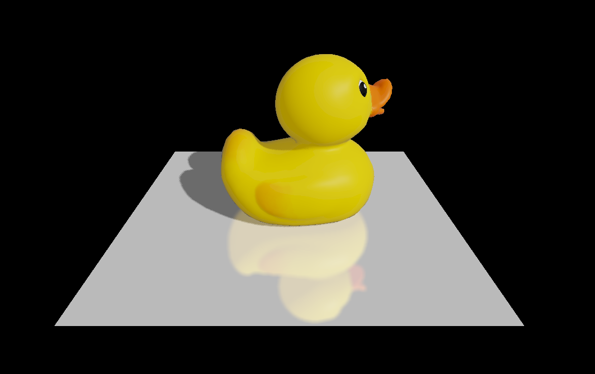
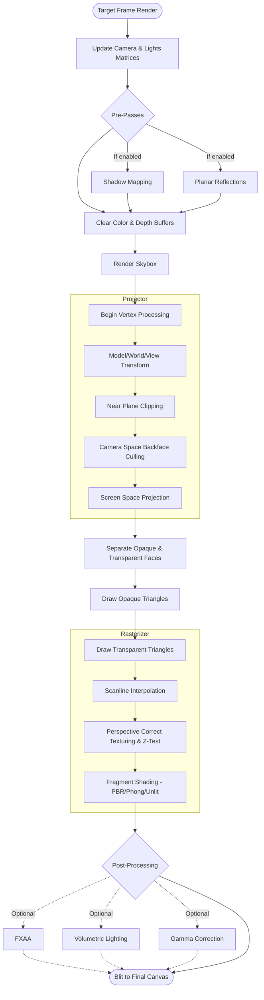

# IgnisRenderer


**IgnisRenderer** is a high-performance 3D software rendering engine built entirely from scratch in TypeScript. It implements the complete graphics pipeline on the CPU, bypassing WebGL/WebGPU to provide a deep understanding of how modern 3D rendering works at its core.

[**Live Demo 🚀**](https://ignis-renderer-demo.netlify.app/)



---

## 🚀 Key Features

### 🛠️ Rendering Core

- **Scanline Rasterizer**: High-quality triangle rasterization with sub-pixel precision.
- **Perspective Correction**: Accurate interpolation of world coordinates, normals, and texture coordinates (UVs) across triangle faces.
- **Sophisticated Clipping**: Full 3D clipping against the camera frustum using homogeneous coordinates.
- **Optimized Pipeline**: Minimal allocation during rendering to ensure smooth performance on the CPU.

### 💡 Lighting & Shading

- **Physically Based Rendering (PBR)**: Implements industry-standard GGX microfacet distribution and Schlick-Fresnel approximations.
- **Multiple Shading Models**:
  - **PBR Strategy**: Realistic material response to lighting.
  - **Blinn-Phong**: Classic specular highlight model.
  - **Gouraud & Flat**: Efficient interpolation-based or per-face shading.
  - **Unlit**: Direct color rendering without lighting calculations.
- **Dynamic Lighting**: Support for `AmbientLight`, `DirectionalLight`, and `PointLight`.
- **Spherical Harmonics (SH)**: Global ambient lighting approximation for realistic environmental influence.

### ✨ Advanced Visual Effects

- **Real-time Shadows**: Dynamic shadow mapping with depth bias and frustum-fitted light cameras.
- **Planar Reflections**: High-quality mirror reflections with support for:
  - **Fresnel Effect**: View-dependent reflectivity.
  - **Blur & Distortion**: Simulated surface roughness and ripple effects.
- **Post-Processing Pipeline**:
  - **FXAA**: Fast Approximate Anti-Aliasing for smooth edges.
  - **Tone Mapping**: Exposure control and Gamma correction (v2.2 convention).

### 📦 Assets & Interaction

- **Model Loaders**: Built-in support for `glTF 2.0` (`.gltf`, `.glb`) and `OBJ` formats.
- **Orbit Camera**: Intuitive 3D navigation with mouse and touch support (Rotate, Zoom, Pan).
- **Material System**: Flexible material properties including diffuse, specular, roughness, metalness, and reflection planes.

---

## 🛠️ Architecture Overview

The renderer is organized into modular components:

- **`core/`**: The engine heartbeat. Contains the `Renderer`, `Scene`, `Rasterizer`, and `Projector`.
- **`shaders/`**: Pluggable shading strategies and material evaluators.
- **`maths/`**: A custom, optimized mathematical library for 3D operations (Vectors, Matrices, Quaternions).
- **`loaders/`**: Asynchronous asset loaders for textures and 3D models.
- **`cameras/`**: Viewport and projection management.
- **`lights/`**: Light source definitions and property management.

### 🔄 Rendering Pipeline Flow



---

## 🚦 Getting Started

### Prerequisites

- [Node.js](https://nodejs.org/) (v18 or higher recommended)
- [npm](https://www.npmjs.com/)

### Installation

1. Clone the repository:
   ```bash
   git clone https://github.com/Kunelinmc/IgnisRenderer.git
   cd IgnisRenderer
   ```
2. Install dependencies:
   ```bash
   npm install
   ```

### Development

Launch the Vite development server:

```bash
npx vite
```

Then open `http://localhost:5173` in your browser.

---

## 📖 Usage Example

```typescript
import {
	Renderer,
	Scene,
	GLTFLoader,
	OrbitCamera,
	DirectionalLight,
} from "./index";

async function main() {
	const canvas = document.getElementById("canvas") as HTMLCanvasElement;
	const camera = new OrbitCamera({ x: 0, y: 0, z: 0 });
	const renderer = new Renderer(canvas, camera);
	const scene = new Scene();

	// Add Lighting
	scene.addLight(new DirectionalLight({ dir: { x: -1, y: -1, z: -1 } }));

	// Load a Model
	const loader = new GLTFLoader();
	const model = await loader.load("./assets/duck.glb");
	scene.addModel(model);

	// Initialize and Render
	renderer.scene = scene;
	renderer.init();
}

main();
```

---

## 📜 License

This project is licensed under the **MIT License**. See the [LICENSE](LICENSE) file for details.
