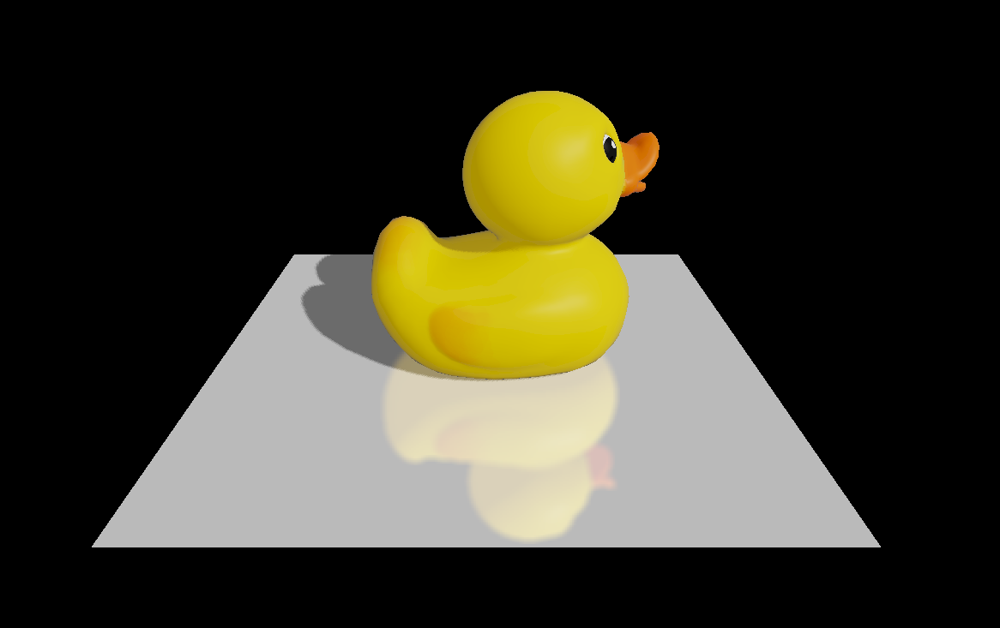
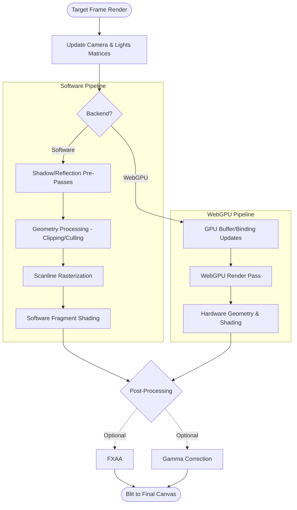

# IgnisRenderer


**IgnisRenderer** is a versatile 3D rendering engine built from scratch in TypeScript. It features a dual-core architecture: a high-performance **CPU Scanline Rasterizer** for a deep dive into graphics fundamentals, and a modern **WebGPU Hardware-Accelerated Pipeline** for real-time performance.

[**Live Demo**](https://ignis-renderer-demo.netlify.app/)



---

## Key Features

### Dual Rendering Backends

- **Software Backend (CPU)**: A complete graphics pipeline implemented from scratch on the CPU, including vertex transformation, clipping, and triangle rasterization.
- **WebGPU Backend (GPU)**: A modern, hardware-accelerated pipeline leveraging the WebGPU API for high-performance real-time rendering.

### Rendering Core

- **Scanline Rasterizer**: High-quality triangle rasterization with sub-pixel precision.
- **Perspective Correction**: Accurate interpolation of world coordinates, normals, and texture coordinates (UVs) across triangle faces.
- **Sophisticated Clipping**: Full 3D clipping against the camera frustum using homogeneous coordinates.
- **Optimized Pipeline**: Minimal allocation during rendering to ensure smooth performance on the CPU.

### Lighting & Shading

- **Physically Based Rendering (PBR)**: Implements industry-standard GGX microfacet distribution and Schlick-Fresnel approximations.
- **Multiple Shading Models**:
  - **PBR Strategy**: Realistic material response to lighting.
  - **Blinn-Phong**: Classic specular highlight model.
  - **Gouraud & Flat**: Efficient interpolation-based or per-face shading.
  - **Unlit**: Direct color rendering without lighting calculations.
- **Dynamic Lighting**: Support for `AmbientLight`, `DirectionalLight`, and `PointLight`.
- **Spherical Harmonics (SH)**: Global ambient lighting approximation for realistic environmental influence.

### Advanced Visual Effects

- **Real-time Shadows**: Dynamic shadow mapping with depth bias and frustum-fitted light cameras.
- **Planar Reflections**: High-quality mirror reflections with support for:
  - **Fresnel Effect**: View-dependent reflectivity.
  - **Blur & Distortion**: Simulated surface roughness and ripple effects.
- **Post-Processing Pipeline**:
  - **FXAA**: Fast Approximate Anti-Aliasing for smooth edges (Software).
  - **Tone Mapping**: Exposure control and Gamma correction (v2.2 convention).

### WebGPU Implementation

- **Programmable Pipeline**: Custom WGSL shaders for high-performance vertex and fragment processing.
- **Dynamic Resource Management**: Efficient allocation and binding of GPU buffers, textures, and samplers.
- **Modern Abstraction Layer**: Standardized Render Abstraction Layer (RAL) that makes switching between CPU and GPU backends seamless.
- **Real-time Shadows**: Hardware-accelerated depth mapping and shadow evaluation.

### Assets & Interaction

- **Model Loaders**: Built-in support for `glTF 2.0` (`.gltf`, `.glb`) and `OBJ` formats.
- **Orbit Camera**: Intuitive 3D navigation with mouse and touch support (Rotate, Zoom, Pan).
- **Material System**: Flexible material properties including diffuse, specular, roughness, metalness, and reflection planes.

---

## Architecture Overview

The renderer is organized into modular components:

- **Definition Layer**
  - **`lights/`** and **`materials/`** store only domain definitions.
  - Pipeline-specific logic is intentionally kept out of these folders.
- **Pipeline Layer (`core/`)**
  - **`Renderer`**: high-level frame orchestration.
  - **`pipeline/`**: frame planning and shared pipeline transforms/helpers.
  - **`software/`**: CPU pipeline implementation.
  - **`backend/`**: backend abstractions plus backend-specific implementations.
    - `backend/webgpu/` contains WebGPU bridge/packing/resources implementation.
- **`shaders/`**: Pluggable shading strategies and WGSL shader modules.
- **`maths/`**: A custom, optimized mathematical library for 3D operations (Vectors, Matrices, Quaternions).
- **`loaders/`**: Asynchronous asset loaders for textures and 3D models.
- **`cameras/`**: Viewport and projection management.
- **`models/`**: Geometry construction and model composition.

### Internal Path Changes

Deep internal imports were reorganized and are **breaking** for private paths:

- `core/bridge/webgpu/*` -> `core/backend/webgpu/*`
- `core/resources/*` -> `core/backend/webgpu/*`
- `core/ral/*` -> `core/backend/*`
- `core/geometry/GeometryBuilder` -> `models/GeometryBuilder`

### Rendering Pipeline Flow


```mermaid
graph TD
    A([Target Frame Render]) --> B[Update Camera & Lights Matrices]
    B --> C{Backend?}

    subgraph Software Pipeline
        C -->|Software| D[Shadow/Reflection Pre-Passes]
        D --> E[Geometry Processing - Clipping/Culling]
        E --> F[Scanline Rasterization]
        F --> G[Software Fragment Shading]
    end

    subgraph WebGPU Pipeline
        C -->|WebGPU| H[GPU Buffer/Binding Updates]
        H --> I[WebGPU Render Pass]
        I --> J[Hardware Geometry & Shading]
    end

    G --> K{Post-Processing}
    J --> K

    K -.->|Optional| L[FXAA]
    K -.->|Optional| M[Gamma Correction]

    L --> N([Blit to Final Canvas])
    M --> N
```

---

## Getting Started

### Prerequisites

- [Node.js](https://nodejs.org/) (v18 or higher recommended)
- [npm](https://www.npmjs.com/)

### Installation

1. Clone the repository:
   ```bash
   git clone https://github.com/Kunelinmc/IgnisRenderer.git
   cd IgnisRenderer
   ```
2. Install dependencies:
   ```bash
   npm install
   ```

### Development

Launch the Vite development server:

```bash
npx vite
```

Then open `http://localhost:5173` in your browser.

---

## Usage Example

```typescript
import {
	Renderer,
	Scene,
	GLTFLoader,
	OrbitCamera,
	DirectionalLight,
	WebGPUBackend,
	SoftwareBackend,
} from "ignis-renderer";

async function main() {
	const canvas = document.getElementById("canvas") as HTMLCanvasElement;
	const camera = new OrbitCamera({ x: 0, y: 0, z: 0 });
	const scene = new Scene();

	// Choose Backend: WebGPU or Software
	const backend = navigator.gpu
		? new WebGPUBackend(canvas)
		: new SoftwareBackend(canvas);

	const renderer = new Renderer(backend, canvas, camera);

	// Add Lighting
	scene.addLight(new DirectionalLight({ dir: { x: -1, y: -1, z: -1 } }));

	// Load a Model
	const loader = new GLTFLoader();
	const model = await loader.load("./assets/duck.glb");
	scene.addModel(model);

	// Initialize and Render
	renderer.scene = scene;
	renderer.init();
}

main();
```

---

## License

This project is licensed under the **MIT License**. See the [LICENSE](LICENSE) file for details.

