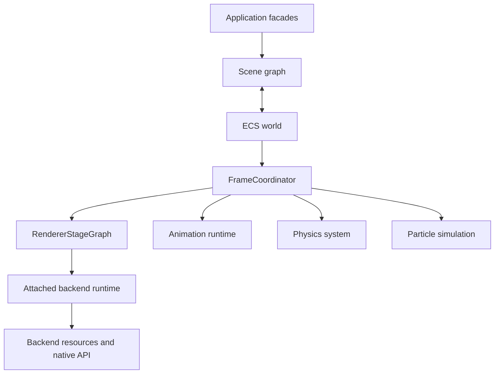

# Engine Architecture

This document explains the major engine layers, their ownership boundaries,
and the paths through which application state becomes simulation and rendering
work. Normative requirements live in the subsystem contracts.

## System Model

IgnisRenderer exposes scene, camera, material, simulation, and renderer
facades while delegating execution to one attached rendering backend.

`Renderer` is the public frame facade. `FrameCoordinator` translates renderer
requests into ECS synchronization, simulation stages, prepared scene data, and
ordered backend passes. Backend instances own device or context state and are
attached to one renderer for their lifetime.

## Responsibility Boundaries

| Layer | Primary responsibility |
| --- | --- |
| Public facades | Application configuration, scene composition, and lifecycle entrypoints |
| Scene graph | Hierarchical authoring state and application-facing node identity |
| ECS | Simulation-ready component state and efficient system queries |
| Simulation runtimes | Animation, physics, and particle state transitions |
| Frame coordinator | Synchronization, stage scheduling, prepared scene construction, and backend dispatch |
| Backend runtime | Device lifecycle, frame transactions, resources, backend passes, and presentation |
| Foundation | Errors, colors, logging, platform checks, and shared identifiers |
| Workers | Parallel task scheduling and transferable or shared payload transport |

Definition layers remain separate from logic layers. Interfaces and data
contracts describe cross-layer communication; systems and runtime owners
perform state transitions.

## Scene and ECS Synchronization

`Node` and related scene objects are application-facing. ECS components hold
the representation consumed by simulation and rendering stages.

The frame coordinator runs synchronization in two directions:

1. Sync-in copies application edits from scene nodes to ECS components.
2. Simulation systems update ECS state.
3. Transform and scene-preparation stages produce renderable state.
4. Sync-out reflects simulation results back to application facades.

This boundary keeps scene authoring ergonomic without requiring simulation
systems to traverse the scene graph directly.

## Backend Ownership

The engine supports Software, WebGPU, and WebGL backend families. They share
the renderer lifecycle and frame-pass vocabulary but retain different internal
execution structures:

- Software performs CPU rasterization and post-processing.
- WebGPU expands renderer passes into an internal whole-frame graph and records
  GPU commands through device-scoped services.
- WebGL uses a context-scoped frame runtime and serializes context work through
  backend-owned coordination.

Native handles, resource lifetime, device loss, context restoration, and
presentation stay within the backend. Optional capabilities cross the boundary
through typed extensions rather than native resource forwarding.

## Simulation and Workers

Animation, physics, and particles are scheduled as explicit simulation stages.
Their runtime state remains owned by the corresponding subsystem rather than
the backend facade. Worker infrastructure supports parallel tasks such as
physics adapters and environment-map processing without introducing
backend-specific types into public contracts.

## Foundation Services

Cross-cutting utilities live under `src/foundation/`. Custom error subclasses
are centralized in `src/foundation/Error.ts`; platform detection, color
conversion, logging, and deterministic identifiers have similarly narrow
owners. This keeps low-level dependencies consistent across public facades,
simulation, workers, and backends.

## Related Documents

- [Rendering architecture](rendering.md)
- [Render Graph architecture](render-graph.md)
- [WebGPU architecture](webgpu.md)
- [Renderer contract](../contracts/renderer.md)
- [Physics contract](../contracts/physics.md)
