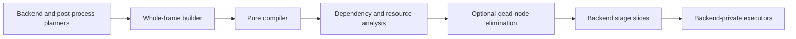

# Render Graph Architecture

This document explains the backend-internal logical Render Graph used by GPU
backends and post-processing. Its normative types, lifecycle rules, and backend
constraints are documented in the renderer, post-process, WebGPU, and WebGL
contracts.

## Scheduling Layers

IgnisRenderer has three related scheduling layers:

1. `RendererStageGraph` orders portable renderer-level stages.
2. WebGPU and WebGL planners expand enabled stages into backend-private nodes.
3. `PostProcessPlanner` resolves pass declarations and contributes a composed
   subgraph to the complete GPU frame.



Software rendering consumes the portable frame and post-process plans directly
and does not require a whole-frame GPU graph.

## Logical Resource Model

The graph represents logical textures, buffers, external resources, resource
generations, subresource ranges, and stable opaque physical bindings. Native
handles never enter the shared graph.

Nodes retain backend-specific kinds and payloads while exposing portable
dependency and resource facts. A resource reference records access and usage;
the analyzer derives hazards, transitions, live ranges, allocation requests,
and diagnostics from those facts.

Logical allocation requests are planning output. Backend managers, pools, and
registries continue to own native allocation, reuse, destruction, and history
state.

## Compilation and Composition

`RenderGraphBuilder` creates immutable definitions and composes named subgraph
imports and exports. `RenderGraphCompiler` validates one complete definition,
applies stable ordering, infers resource dependencies, optionally removes
unreachable nodes, and emits stage slices for backend execution.

GPU backends compile the complete enabled frame before the first graph-owned
backend pass executes. WebGPU normally compiles during `beginFrame()`; when
`particle-sim` is enabled, it defers compilation until that out-of-graph stage
has emitted current-frame render batches. Graph-owned `executePass()` calls
consume already compiled slices and do not invoke another shared compiler.

Post-processing is flattened into the same graph. Each eligible logical pass
becomes an outer post-process node, while resource declarations and color
versions remain owned by the post-process plan.

## Frame Attempts

The attempt tracker separates a compiled plan from a successfully committed
frame:

```text
idle -> active -> sealed -> committed
                       \-> aborted
active -----------------> aborted
```

The current attempt exists only while work is active or sealed. The last
attempt records either outcome; the last successful snapshot advances only
after execution, submission, presentation, history updates, custom-target
publication, and deferred lifecycle work have all committed.

Skipped nodes and logical color aliases are stored in an execution overlay.
The overlay explains runtime outcomes without rewriting the immutable compiled
graph.

## Diagnostics

Graph diagnostics are divided into enforced failures and shadow observations.
Enforced failures cover invalid definitions, cycles, missing dependencies,
unsupported usage, and backend feedback constraints. Shadow diagnostics expose
incomplete modeling, implicit resources, unknown imported content, or opaque
execution without changing compatibility behavior.

Backend debug facades project legacy views from the one compiled graph rather
than running separate analysis state machines.

## Ownership Boundaries

The shared graph describes ordering and logical resource behavior. Backend
executors record commands and state changes. Resource owners manage native
objects. The graph does not expose a public registration API, lower native
barriers, or become a native allocator.

## Related Documents

- [Rendering architecture](rendering.md)
- [WebGPU architecture](webgpu.md)
- [Post-process contract](../contracts/postprocess.md)
- [WebGPU contract](../contracts/webgpu.md)
- [WebGL contract](../contracts/webgl.md)
