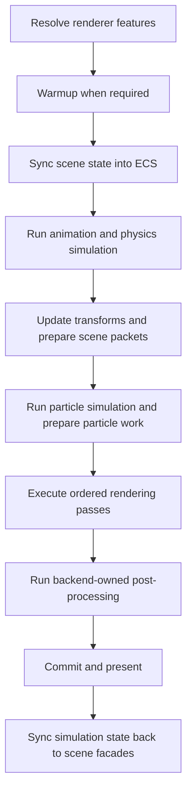
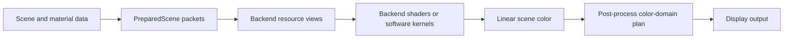

# Rendering Architecture

This document explains the cross-backend frame pipeline, data conventions, and
ownership boundaries. Normative rendering, shader, material, lighting, and
post-process behavior lives in the linked contracts.

## Frame Flow

The renderer pipeline expresses portable intent. A backend may expand one
renderer stage into several native passes as long as the shared ordering and
transaction boundaries remain intact. WebGPU deferred lighting, for example,
is an internal expansion of `main-opaque`, not an additional global stage.

Shadow authoring definitions and persistent light bindings belong to
`Scene.shadows`. `ShadowPlanner` resolves them once into an immutable
`ShadowFramePlan` before backend execution. Backend shadow runtimes own physical
atlas or paged resources and publish backend-private sampling state; they do not
rewrite the shared plan. Current particle work may attach after simulation as a
late `ShadowWorkSet` without changing the plan's resource topology.

Before the frame plan is created, `FrameCoordinator` composes prepared scene
work, subsystem render intent, post-process intent, and resolved render support
into backend-neutral `FramePassRequirements`. The default pipeline consumes
that snapshot and does not branch on backend identifiers or capability objects.

## Data Conventions

IgnisRenderer uses a right-handed world, linear-light shading, and explicit
CPU-to-GPU matrix packing. The rendering contract owns the exact coordinate,
matrix, vertex-layout, texture-decoding, and color-domain requirements.

The data path is:

Backend-specific packing is private, while logical semantics such as position,
normal, motion, roughness, metallic, and specular remain explicit at shared
boundaries.

Prepared mesh work is split into two layers. A camera-independent
`DrawSubmission` resolves authoring objects into narrow source, geometry,
instance, material, deformation, bounds, and pass bindings. A `DrawPacket`
references one submission and adds only view-dependent sorting state. Published
submissions are readonly and may be shared by packets for different cameras;
packets themselves are owned by one camera view.

`PreparedSceneBuilder` is the resolution boundary for `MeshInstance`,
`MeshAsset`, and primitive authoring state. Backends consume resolved bindings
and must not recover scene or mesh ownership from geometry resource identity.

`TextureFormat` and backend-neutral `TextureFormatInfo` metadata are owned by
`src/core/TextureFormat.ts`. Backend-specific format capabilities and storage
costs remain in their owning backend modules.

WebGL uses a strict internal HDR pipeline and may present Display HDR when the
browser exposes a verified floating-point drawing buffer. Scene, post-process,
OIT, and transmission intermediates retain linear `rgba16float` radiance until
display conversion. Chromium implementations with `drawingBufferStorage()` may
present through an `RGBA16F` Display-P3 drawing buffer; other implementations
retain the same internal HDR pipeline and fall back to SDR presentation. A
backend that cannot create and linearly filter the internal resources is
unavailable rather than a different normalized-color renderer.

## Shader Ownership

Shader sources are stored by backend applicability under `src/shaders/`.
Runtime transformation and source mapping are owned by the shader runtime;
scene, material, post-process, and backend services own their pipeline and
binding integration. TypeScript orchestration references shader assets instead
of embedding long source strings.

Each GPU backend declares its built-in assets, source products,
specialization rules, and directive-profile inputs in one pure-data shader
manifest. `ShaderSource` interprets those manifests and owns source loading and
caching. Backend services derive specialization parameters but must not rewrite
built-in shader text directly.

Directive profiles follow the same ownership boundary. Prepared static bases
provide asset-backed include modules, while each backend instance contributes a
capability-resolved overlay. Backend material compilers may add structured
generated source blocks between directive expansion and runtime validation.
The generic shader runtime composes and executes supplied inputs but does not
construct WebGPU, WebGL, or Software profiles or material ABI declarations.

## Lighting and Materials

Prepared scene lights are normalized into backend-appropriate views before
feature runtimes consume them. Clustered lighting, probes, shadows, materials,
and environment IBL retain separate state owners while sharing explicit scene
and shader data contracts.

Environment prefiltering is a standalone workflow owned by `IBLPrefilter` and
its CPU, worker, WebGPU, or WebGL executor. GPU executors consume generic
backend capabilities: WebGPU compute or WebGL auxiliary raster work. Backends
must not construct or register IBL-specific executors. Renderer frame
scheduling does not own environment bake work.

Public analytical lights share meter-based geometry and physical-unit
semantics across backends. SH stores radiance; the consuming BRDF owns the
Lambertian `1 / PI` factor. WebGL transmissive packets remain sorted scene
work: the frame graph snapshots accumulated scene color before each packet so
nearer surfaces can refract already-composited farther transparent surfaces.

## Post-Processing

`Renderer` owns the public post-process registry; backends own execution.
`PostProcessPlanner` resolves logical order and resource declarations once per
frame. GPU backends compose the resulting subgraph into their authoritative
whole-frame graph, while Software executes the logical plan directly.

WebGPU feature modules exchange backend-private typed frame messages during
analysis, configuration, and graph planning. Message handlers declare their
inputs and outputs when the runtime is composed; the registry validates an
acyclic dependency graph before the first frame. A module must not invoke or
retain another feature module to establish frame ordering. Cross-feature
requirements are represented as resource demands and graph dependencies.

Histories, camera jitter, color versions, and presentation participate in the
same frame transaction. Failed or skipped work is resolved by the backend
runtime without exposing a public backend graph API.

## Placement Guide

| Change | Owning area |
| --- | --- |
| Cross-backend renderer stage | `src/pipeline/` and renderer contract |
| Shadow definition or binding | `src/lights/shadows/` and shadow contract |
| Cross-backend shadow planning | `src/lights/shadows/` and shadow contract |
| Native shadow resources or graph nodes | Owning backend shadow runtime |
| Backend-private pass expansion | Owning backend runtime and backend contract |
| Cross-backend post-process pass | `src/postprocess/passes/` and post-process contract |
| Shader transformation | `src/shaders/runtime/` and shader contract |
| Material or texture semantics | Materials contract and backend resource integration |
| Lighting or probe behavior | Lighting contract and owning runtime |
| Presentation or output encoding | Backend contract and post-process color-domain plan |

## Related Documents

- [Engine architecture](engine.md)
- [Render Graph architecture](render-graph.md)
- [WebGPU architecture](webgpu.md)
- [Rendering contract](../contracts/rendering.md)
- [Shader contract](../contracts/shaders.md)
- [Post-process contract](../contracts/postprocess.md)
- [Software backend contract](../contracts/software.md)
