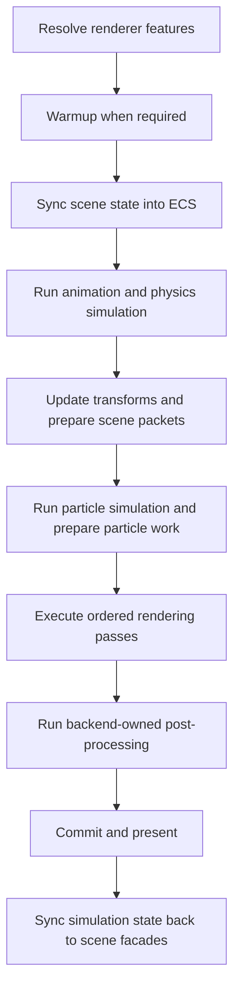
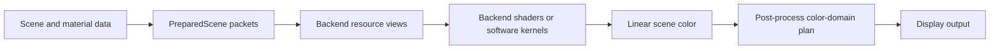

# Rendering Architecture

This document explains the cross-backend frame pipeline, data conventions, and
ownership boundaries. Normative rendering, shader, material, lighting, and
post-process behavior lives in the linked contracts.

## Frame Flow

The renderer pipeline expresses portable intent. A backend may expand one
renderer stage into several native passes as long as the shared ordering and
transaction boundaries remain intact. WebGPU deferred lighting, for example,
is an internal expansion of `main-opaque`, not an additional global stage.

## Data Conventions

IgnisRenderer uses a right-handed world, linear-light shading, and explicit
CPU-to-GPU matrix packing. The rendering contract owns the exact coordinate,
matrix, vertex-layout, texture-decoding, and color-domain requirements.

The data path is:

Backend-specific packing is private, while logical semantics such as position,
normal, motion, roughness, metallic, and specular remain explicit at shared
boundaries.

## Shader Ownership

Shader sources are stored by backend applicability under `src/shaders/`.
Runtime transformation and source mapping are owned by the shader runtime;
scene, material, post-process, and backend services own their pipeline and
binding integration. TypeScript orchestration references shader assets instead
of embedding long source strings.

## Lighting and Materials

Prepared scene lights are normalized into backend-appropriate views before
feature runtimes consume them. Clustered lighting, probes, shadows, materials,
and environment IBL retain separate state owners while sharing explicit scene
and shader data contracts.

Environment prefiltering is a standalone workflow owned by `IBLPrefilter` and
its CPU, worker, WebGPU, or WebGL executor. Renderer frame scheduling does not
own environment bake work.

## Post-Processing

`Renderer` owns the public post-process registry; backends own execution.
`PostProcessPlanner` resolves logical order and resource declarations once per
frame. GPU backends compose the resulting subgraph into their authoritative
whole-frame graph, while Software executes the logical plan directly.

Histories, camera jitter, color versions, and presentation participate in the
same frame transaction. Failed or skipped work is resolved by the backend
runtime without exposing a public backend graph API.

## Placement Guide

| Change | Owning area |
| --- | --- |
| Cross-backend renderer stage | `src/pipeline/` and renderer contract |
| Backend-private pass expansion | Owning backend runtime and backend contract |
| Cross-backend post-process pass | `src/postprocess/passes/` and post-process contract |
| Shader transformation | `src/shaders/runtime/` and shader contract |
| Material or texture semantics | Materials contract and backend resource integration |
| Lighting or probe behavior | Lighting contract and owning runtime |
| Presentation or output encoding | Backend contract and post-process color-domain plan |

## Related Documents

- [Engine architecture](engine.md)
- [Render Graph architecture](render-graph.md)
- [WebGPU architecture](webgpu.md)
- [Rendering contract](../contracts/rendering.md)
- [Shader contract](../contracts/shaders.md)
- [Post-process contract](../contracts/postprocess.md)
