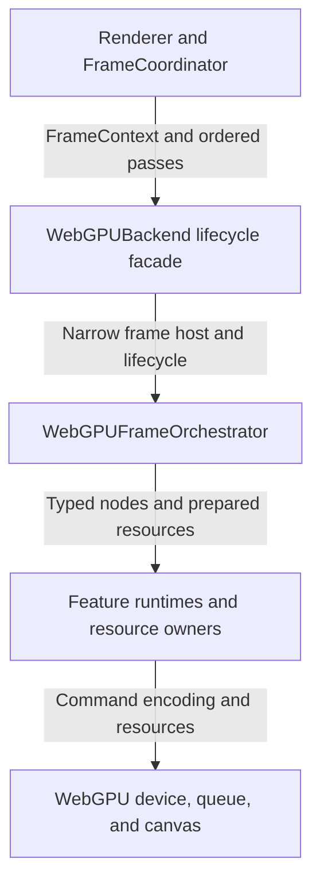
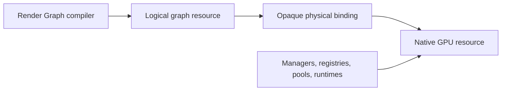

# WebGPU Architecture

This document explains how a renderer frame becomes WebGPU work and where
planning, execution, resources, and transaction state are owned. Normative
behavior lives in the WebGPU and shared subsystem contracts.

## Layer Model

Renderer stages express backend-agnostic intent. The WebGPU planner expands
those stages into internal nodes and logical resource dependencies. Feature
runtimes record commands, while managers, registries, pools, and services own
native resource lifetimes.

## Frame Flow

1. `FrameCoordinator` resolves portable features, synchronizes ECS, runs the
   renderer-owned simulation stages, prepares the baseline scene, and creates
   `FrameContext` with the ordered backend passes.
2. `WebGPUBackend.beginFrame()` establishes the backend transaction. Frames
   without particle simulation proceed directly to frame sealing.
3. When enabled, the `particle-sim` pass emits current-frame render batches.
4. Frame sealing prepares one mesh-particle packet set for the active view.
5. Frame analysis identifies desired scene and post-process work.
6. Configuration resolution applies capabilities and fallback policy.
7. Target managers allocate or reuse frame-sized resources.
8. The planner and compiler create one complete frame graph.
9. Renderer backend passes execute their precompiled node slices.
10. Presentation and final copies are recorded.
11. Labeled command buffers are submitted in order.
12. Histories, graph analysis, custom targets, and deferred lifecycle work
    commit after the frame succeeds.

## Stage Expansion

One portable stage may expand into several WebGPU nodes. `main-opaque` can
include background work, G-buffer rendering, projected decals, deferred
lighting, forward fallback materials, planar reflection composition, Hi-Z, and
occlusion work. Transparent rendering can expand into forward or OIT node
sequences. Post-processing contributes one node per eligible logical pass.

This expansion remains internal to WebGPU and does not add equivalent stages
to Software or WebGL.

## Responsibility Boundaries

| Owner | Responsibility |
| --- | --- |
| `Renderer` / `FrameCoordinator` | Portable stage order, simulation, prepared scenes, and frame context |
| `WebGPUBackend` | Attachment, device and canvas lifecycle, frame entrypoints, device loss, extensions, and commit coordination |
| `WebGPUFrameHost` | Narrow device-scoped access to resources, command recording, submission, and validation |
| `WebGPUFrameOrchestrator` | Active frame session, configuration, graph composition, stage execution, and presentation finalization |
| Frame graph planner/compiler | Node expansion, ordering, logical resources, dependencies, stage slices, and diagnostics |
| Feature runtimes | Shadow, scene, deferred, transparency, reflection, visibility, post-process, and presentation commands |
| Resource owners | Native texture, buffer, pipeline, binding, pool, and frame-target lifetimes |
| Particle render resources | Owner-managed billboard pipelines, particle buffers, bindings, and pass recording |
| Mesh-particle frame preparation | Backend-private, device-independent conversion and classification of current-view particle batches |
| Post-process runtime | Logical plan, declarations, histories, transients, and history transactions |
| Frame committer | Labeled command-buffer retention and ordered submission |

## Resource Views

The compiler sees logical identities and stable opaque bindings. Only WebGPU
resource owners resolve those bindings to native objects. Allocation requests
remain analysis output and do not transfer ownership to the graph.

## Failure Boundaries

The backend maintains one active frame transaction. Failures before submission
discard pending encoders, histories, and unpublished targets. Partial
submission failures report submitted and pending command labels because
already submitted GPU work cannot be rolled back. Device loss invalidates
backend-owned post-process and frame services in lifecycle order.

## Placement Guide

| Change | Primary owner |
| --- | --- |
| Portable renderer stage | `src/pipeline/` |
| WebGPU-only work inside a stage | WebGPU graph planner, node executor, and feature runtime |
| Cross-backend post-process effect | `src/postprocess/passes/` |
| Frame-sized WebGPU target | Frame target manager and graph resource catalog |
| Device-lifetime feature resource | Frame service owner or delegated registry |
| Particle billboard rendering | Owner-managed particle render resources exposed only to leaf recording runtimes |
| Mesh-particle draw-packet construction | Backend-private frame preparation with no device-resource ownership |
| Backend-agnostic graph analysis | `src/rendergraph/` |
| WebGPU-specific validation | WebGPU graph facade |

## Related Documents

- [Engine architecture](engine.md)
- [Rendering architecture](rendering.md)
- [Render Graph architecture](render-graph.md)
- [WebGPU contract](../contracts/webgpu.md)
- [Post-process contract](../contracts/postprocess.md)
- [WebGPU bindings reference](../reference/webgpu-bindings.md)
