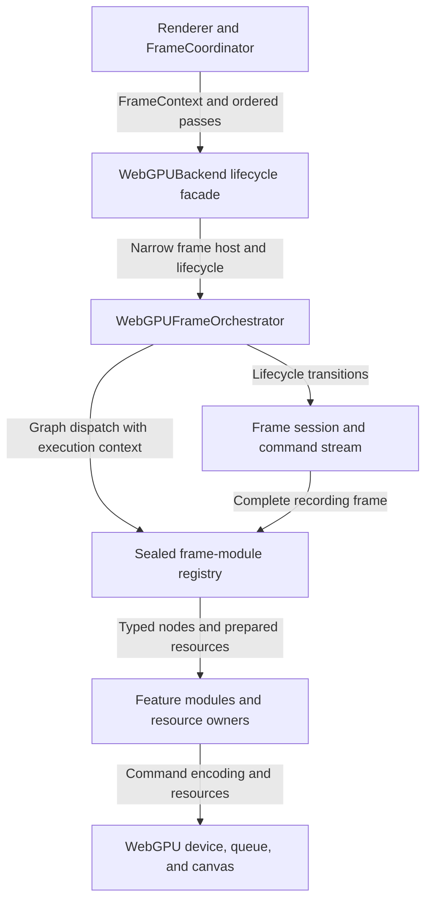
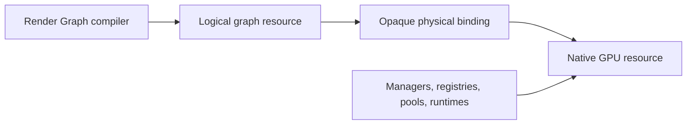

# WebGPU Architecture

This document explains how a renderer frame becomes WebGPU work and where
planning, execution, resources, and transaction state are owned. Normative
behavior lives in the WebGPU and shared subsystem contracts.

## Layer Model

Renderer stages express backend-agnostic intent. WebGPU feature modules expand
those stages into internal nodes and logical resource dependencies. Feature
runtimes record commands, while managers, registries, pools, and services own
native resource lifetimes.

## Frame Flow

1. `FrameCoordinator` resolves portable features, runs the renderer-owned
   simulation stages, prepares the baseline scene, and creates `FrameContext`
   with the ordered backend passes. Any ECS projection is user-owned and is
   not part of this frame lifecycle.
2. Awaited `WebGPUBackend.beginFrame()` establishes the backend transaction.
   Frames without particle simulation complete message dispatch, allocation,
   and graph sealing before it resolves.
3. When enabled, the `particle-sim` pass emits current-frame render batches.
4. Frame sealing composes one view-local frame packet set from prepared-scene
   packets and registered backend contributors.
5. Registered frame modules analyze their feature-owned work into immutable
   typed messages.
6. Feature configuration handlers apply capabilities and fallback policy. A
   generic reducer merges their target and logical-resource demands.
7. Target managers allocate or reuse frame-sized resources.
8. The frame scope prepares resources, then sealing publishes one complete
   recording execution context containing the command stream and target view.
9. Planning handlers publish graph fragments. General stage lanes and static
   edges assemble those fragments before the compiler creates one complete
   frame graph.
10. Renderer backend passes execute their precompiled node slices.
11. Presentation and final copies are recorded.
12. The frame command stream submits labeled command buffers in order.
13. Histories, graph analysis, custom targets, and deferred lifecycle work
    commit after the frame succeeds.

## Stage Expansion

One portable stage may expand into several WebGPU nodes. `main-opaque` can
include background work, G-buffer rendering, projected decals, deferred
lighting, forward fallback materials, planar reflection composition, Hi-Z, and
occlusion work. Transparent rendering can expand into forward or OIT node
sequences. Post-processing contributes one node per eligible logical pass.

This expansion remains internal to WebGPU and does not add equivalent stages
to Software or WebGL.

## Responsibility Boundaries

| Owner | Responsibility |
| --- | --- |
| `Renderer` / `FrameCoordinator` | Portable stage order, simulation, prepared scenes, and frame context |
| `WebGPUBackend` | Attachment, device and canvas lifecycle, frame entrypoints, device loss, extensions, and commit coordination |
| `WebGPUFrameHost` | Narrow device-scoped access to resources, command recording, submission, and validation |
| `WebGPUFrameOrchestrator` | One active session, target retry, graph compilation and dispatch, and transaction transitions |
| `WebGPUFrameSession` | Discriminated preparing, recording, committing, or skipped frame state |
| `WebGPUFrameCommandStream` | Current encoder, labeled encoder splits, ordered submission, abort, and commit diagnostics |
| Runtime composition | Module construction, feature capabilities, feature lifecycle, warmup, and destruction |
| Frame-module registry | Initialization-time module registration, message DAG sealing, deterministic lane assembly, lifecycle dispatch, and owner-aware executor lookup |
| Feature modules / frame graph compiler | Node expansion, ordering, logical resources, dependencies, stage slices, and diagnostics |
| Feature modules | Feature analysis, configuration requirements, graph contributions, commands, warmup, and pass-local lifecycle |
| Resource owners | Native texture, buffer, pipeline, binding, pool, and frame-target lifetimes |
| Scene pipeline resources | Shared forward, G-buffer, Early-Z, and capture scene variants |
| Particle render resources | Owner-managed billboard pipelines, particle buffers, bindings, and pass recording |
| Frame packet contributors | Backend-composed, device-independent conversion of supplemental current-view draw work |
| Post-process runtime | Logical plan, declarations, histories, transients, and history transactions |
| Frame committer | Low-level labeled command-buffer retention and ordered submission behind the command stream |

## Frame State Layers

The orchestrator holds only the active-session slot and coordinates state
transitions. A recording session is created only after analysis, target
configuration, graph compilation, and main-scope resource preparation succeed.
It contains a complete execution context; recording code does not recover
individual fields through orchestrator callbacks.

The frame target manager owns physical allocation and publishes a stable
frame-scoped target view without transferring native ownership. The command
stream owns encoder rotation and submission state. Visibility, deferred,
transparency, post-process, and presentation modules retain their own mutable
per-frame feature state and exchange only narrow typed ports.

Runtime composition is backend-owned. The backend retains feature capabilities
needed by extensions, readback, warmup, and invalidation, while the orchestrator
receives only the sealed module registry required for graph dispatch.

## Resource Views

The compiler sees logical identities and stable opaque bindings. Only WebGPU
resource owners resolve those bindings to native objects. Allocation requests
remain analysis output and do not transfer ownership to the graph.

## Failure Boundaries

The backend maintains one active frame transaction. Failures before submission
discard pending encoders, histories, and unpublished targets. Partial
submission failures report submitted and pending command labels because
already submitted GPU work cannot be rolled back. Device loss invalidates
backend-owned post-process and frame services in lifecycle order.

Optional frame diagnostics use an injected observer. The observer receives
immutable lifecycle, target, graph, node, and commit snapshots and does not
become a production runtime capability or retain native resource ownership.

## Placement Guide

| Change | Primary owner |
| --- | --- |
| Portable renderer stage | `src/pipeline/` |
| WebGPU-only work inside a stage | Owning WebGPU frame module and its feature runtime |
| Cross-backend post-process effect | `src/postprocess/passes/` |
| Frame-sized WebGPU target | Frame target manager and graph resource catalog |
| Device-lifetime feature resource | Frame service owner or delegated registry |
| Particle billboard rendering | Owner-managed particle render resources exposed only to leaf recording runtimes |
| Supplemental draw-packet construction | Backend packet contributor with no device-resource ownership |
| Backend-agnostic graph analysis | `src/rendergraph/` |
| WebGPU-specific validation | WebGPU graph facade |

Frame modules are backend-private and are registered by the WebGPU runtime
composition root before rendering begins. The registry is sealed before the
first frame, and module registration order has no execution meaning. General
stage lanes, static same-lane edges, and graph resource dependencies determine
the compiled sequence. Planning also publishes the sealed final output
consumed by presentation. This composition boundary does not expose a public
frame-graph API.

## Related Documents

- [Engine architecture](engine.md)
- [Rendering architecture](rendering.md)
- [Render Graph architecture](render-graph.md)
- [WebGPU contract](../contracts/webgpu.md)
- [Post-process contract](../contracts/postprocess.md)
- [WebGPU bindings reference](../reference/webgpu-bindings.md)
