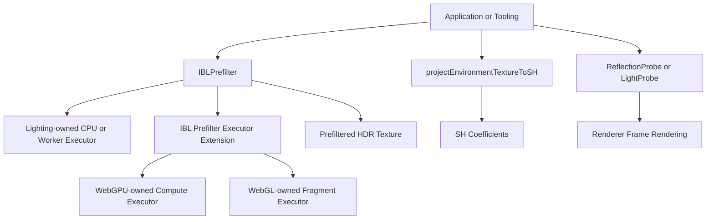

# IBL Prefilter Contract

## Scope

This document defines the standalone environment IBL prefilter contract.
The contract covers `IBLPrefilter`, `prefilterEnvironmentIBL`,
`projectEnvironmentTextureToSH`, backend selection, output texture shape, and
ownership boundaries with `Renderer`.

## Background

Environment specular prefiltering is independent from frame rendering.
`Renderer` must not schedule, own, or configure IBL prefilter work. Applications
and tooling must invoke `IBLPrefilter` or `prefilterEnvironmentIBL` explicitly
for specular IBL textures, invoke `projectEnvironmentTextureToSH` explicitly for
diffuse SH coefficients, then assign the resulting data to probes.



## API/Contract

- `IBLPrefilter` must accept an `IBLPrefilterServiceOptions` object at
  construction time. The object may provide one `IRenderBackend`.
- Per-call `IBLPrefilterOptions` must contain only execution settings and must
  not override the service backend.
- The one-shot helper must receive construction settings through
  `PrefilterEnvironmentIBLOptions.service`.
- When an `IRenderBackend` is provided, `IBLPrefilter` must resolve one generic
  executor through `IBL_PREFILTER_EXECUTOR_EXTENSION`. It must not inspect,
  cast, initialize, restore, or destroy the backend.
- Lighting-owned CPU and Worker executors and backend-owned WebGPU and WebGL
  executors must implement the same internal execution contract.
- Backend executors must report an id, availability state, whether they accept
  requests in that state, and a descriptive unavailable reason.
- Work plans must contain output dimensions, mip levels, and roughness only.
  Source revision data used by deferred work must travel with the execution
  request instead of the work plan.
- `IBLPrefilter.prefilter(envMap, options)` must return an HDR `Texture` whose
  `mipmaps` encode roughness levels.
- Equirectangular input and output directions must use
  `phi = u * 2 * PI - PI` and `theta = v * PI`, matching runtime and shader
  environment sampling.
- Prefiltered equirectangular output must use horizontal repeat and vertical
  clamp addressing. Sampling across the longitude seam may wrap, while the
  north and south poles must not wrap into each other.
- `prefilterEnvironmentIBL(envMap, options)` must provide a one-shot helper with
  the same behavior as constructing `IBLPrefilter` and calling `prefilter`.
- `projectEnvironmentTextureToSH(envMap, options)` must project a valid
  environment texture into radiance SH coefficients and must not prefilter
  specular IBL data.
- `IBLPrefilterOptions` must use `maxSampleWidth`, `maxSampleHeight`, and
  `maxMipLevels` for output limits.
- `IBLPrefilterOptions.acceleration` must support `auto`, `single-thread`,
  `multi-thread`, `webgpu`, and `webgl`.
- `single-thread` must execute prefiltering synchronously on the calling
  JavaScript thread. `multi-thread` must distribute mip work through the Worker
  scheduler.
- If `acceleration` is `webgpu` or `webgl`, the configured backend must expose
  an accepting `IBL_PREFILTER_EXECUTOR_EXTENSION` with the matching executor id.
- An explicit WebGL request made while the context is lost must wait in the
  backend context work queue until restoration or cancellation. A WebGL request
  already executing when loss occurs must reject and must not replay.
- WebGL fragment acceleration must require `EXT_color_buffer_float` and either
  `OES_texture_float_linear` or `OES_texture_half_float_linear`.
- If `acceleration` is `auto`, a ready backend executor must take priority over
  Worker and single-thread CPU execution.
- Executor failures after execution starts must be surfaced and must not cause
  `auto` to replay work through another executor.
- `auto` must treat a lost WebGL context as temporarily unavailable and fall
  back immediately instead of waiting for restoration.
- If `acceleration` is `webgpu`, an `IRenderBackend` without the matching IBL
  executor or with an unavailable WebGPU device or queue must cause a
  descriptive error.
- `IBLPrefilter` and `prefilterEnvironmentIBL` must not accept direct WebGPU
  compute sources, `Renderer` instances, or renderer-like wrappers as service
  options.
- `Renderer` must not expose environment IBL prefilter or update methods.
- `Renderer.warmup()` must not create `LightProbe` instances, assign
  `LightProbe.sh`, or assign `ReflectionProbe.prefilteredMap`.
- `maxMipLevels` is an upper bound. The resolved output mip count must not
  exceed the natural mip chain of the resolved base dimensions.
- Multi-level prefiltered textures and reflection-probe atlases must use
  `LinearMipmapLinear`; single-level textures must use `Linear`.
- WebGL fragment acceleration must read each generated mip back into a
  backend-agnostic `Float32Array`. It must not expose or retain native WebGL
  texture handles in the returned `Texture`.

## Usage

```ts
const prefilter = new IBLPrefilter({ backend: renderBackend });
const prefilteredMap = await prefilter.prefilter(environmentTexture, {
	acceleration: "auto",
	maxSampleWidth: 128,
	maxSampleHeight: 64,
	maxMipLevels: 5,
});

reflectionProbe.prefilteredMap = prefilteredMap;
reflectionProbe.markRuntimeDirty();
```

```ts
const sh = projectEnvironmentTextureToSH(environmentTexture, {
	maxSampleWidth: 128,
	maxSampleHeight: 64,
});

const prefilteredMap = await prefilterEnvironmentIBL(environmentTexture, {
	service: { backend: webgpuBackend },
	acceleration: "auto",
	maxSampleWidth: 128,
	maxSampleHeight: 64,
	maxMipLevels: 5,
});

lightProbe.sh = sh;
reflectionProbe.prefilteredMap = prefilteredMap;
```

```bash
bun tests/static/lighting/test_ibl_prefilter.mjs
```

## Errors & Diagnostics

- `IBLPrefilter.prefilter()` must throw when `envMap` is not a valid 2D
  equirectangular texture or cubemap.
- `IBLPrefilter.prefilter()` must throw an `AbortError` when `signal` is
  aborted.
- Explicit `webgpu` acceleration must throw when the service backend does not
  expose an accepting WebGPU IBL executor.
- Explicit `webgl` acceleration must throw when the backend is uninitialized,
  lacks required extensions, or fails framebuffer or readback validation. A
  request submitted while the context is lost must wait for restoration or
  cancellation.
- Explicit `multi-thread` acceleration must throw when the Worker API is
  unavailable.

## Compatibility / Breaking Changes

This change is breaking.
`Renderer.setEnvironmentIBLUpdateOptions()`,
`Renderer.getEnvironmentIBLUpdateOptions()`,
`Renderer.requestEnvironmentIBLUpdate()`, `WarmupOptions.environmentIBLBake`,
`WarmupOptions.includeEnvironmentIBLBake`,
`bakeEnvironmentIBLFromEnvironmentMap()`, and `EnvironmentIBLBake*` types are
removed. Consumers must use `projectEnvironmentTextureToSH` for SH data and
`IBLPrefilter` or `prefilterEnvironmentIBL` for specular prefilter textures.
`Renderer` instances, renderer-like wrappers, and direct WebGPU compute sources
are no longer accepted. Consumers must pass an `IBLPrefilterServiceOptions`
object containing at most one `IRenderBackend`.
The `cpu` and `worker` acceleration values are replaced by `single-thread` and
`multi-thread`, respectively.
The `webgl` acceleration value is additive. Existing `auto` callers using an
initialized capable `WebGLBackend` may now execute on the GPU before Worker or
single-thread fallback.
`IBLPrefilterConstructorOptions`, `IBLPrefilterBackendSource`,
`IBLPrefilterSourceOptions`, positional constructor sources,
`IBLPrefilterOptions.backend`, `IBLPrefilterOptions.computeSource`, and direct
`webgpuComputeSource` values are removed. Consumers must pass an
`IBLPrefilterServiceOptions` object to the constructor, or use the helper's
`service` property, and keep execution settings in `IBLPrefilterOptions`.
