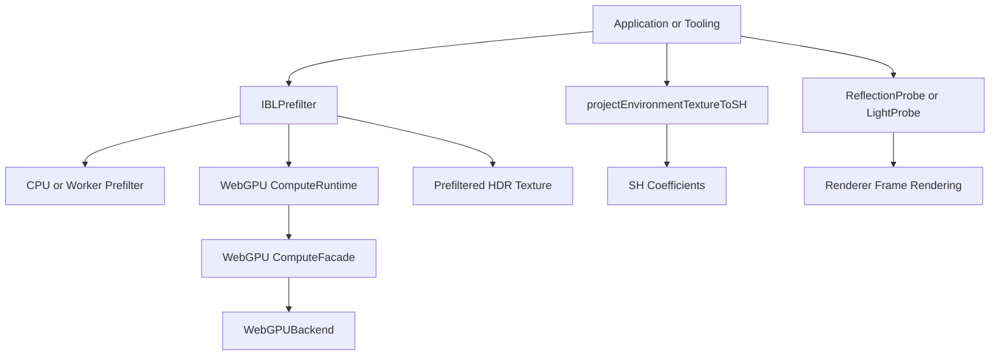

# IBL Prefilter Contract
## Scope
This document defines the standalone environment IBL prefilter contract.
The contract covers `IBLPrefilter`, `prefilterEnvironmentIBL`,
`projectEnvironmentTextureToSH`, backend selection, output texture shape, and
ownership boundaries with `Renderer`.

## Background
Environment specular prefiltering is independent from frame rendering.
`Renderer` must not schedule, own, or configure IBL prefilter work. Applications
and tooling must invoke `IBLPrefilter` or `prefilterEnvironmentIBL` explicitly
for specular IBL textures, invoke `projectEnvironmentTextureToSH` explicitly for
diffuse SH coefficients, then assign the resulting data to probes.



## API/Contract
- `IBLPrefilter` must accept an optional `Renderer`, attached backend, or WebGPU
  compute source at construction time.
- `IBLPrefilter.prefilter(envMap, options)` must return an HDR `Texture` whose
  `mipmaps` encode roughness levels.
- `prefilterEnvironmentIBL(envMap, options)` must provide a one-shot helper with
  the same behavior as constructing `IBLPrefilter` and calling `prefilter`.
- `projectEnvironmentTextureToSH(envMap, options)` must project a valid
  environment texture into radiance SH coefficients and must not prefilter
  specular IBL data.
- `IBLPrefilterOptions` must use `maxSampleWidth`, `maxSampleHeight`, and
  `maxMipLevels` for output limits.
- `IBLPrefilterOptions.acceleration` must support `auto`, `worker`, `cpu`, and
  `webgpu`.
- If `acceleration` is `webgpu`, a WebGPU renderer, attached backend, or compute
  source must be provided.
- If `acceleration` is `auto`, WebGPU may be used when a valid WebGPU source is
  available; otherwise worker or CPU fallback may be used.
- `Renderer` must not expose environment IBL prefilter or update methods.
- `Renderer.warmup()` must not create `LightProbe` instances, assign
  `LightProbe.sh`, or assign `ReflectionProbe.prefilteredMap`.

## Usage
```ts
const prefilter = new IBLPrefilter(renderer);
const prefilteredMap = await prefilter.prefilter(environmentTexture, {
	acceleration: "auto",
	maxSampleWidth: 128,
	maxSampleHeight: 64,
	maxMipLevels: 5,
});

reflectionProbe.prefilteredMap = prefilteredMap;
reflectionProbe.markRuntimeDirty();
```

```ts
const sh = projectEnvironmentTextureToSH(environmentTexture, {
	maxSampleWidth: 128,
	maxSampleHeight: 64,
});

const prefilteredMap = await prefilterEnvironmentIBL(environmentTexture, {
	backend: renderer,
	acceleration: "auto",
	maxSampleWidth: 128,
	maxSampleHeight: 64,
	maxMipLevels: 5,
});

lightProbe.sh = sh;
reflectionProbe.prefilteredMap = prefilteredMap;
```

```bash
bun tests/static/lighting/test_ibl_prefilter.mjs
```

## Errors & Diagnostics
- `IBLPrefilter.prefilter()` must throw when `envMap` is not a valid 2D
  equirectangular texture or cubemap.
- `IBLPrefilter.prefilter()` must throw an `AbortError` when `signal` is
  aborted.
- Explicit `webgpu` acceleration must throw when no WebGPU renderer, attached
  backend, or compute source is available.
- Explicit `worker` acceleration must throw when the Worker API is unavailable.

## Compatibility / Breaking Changes
This change is breaking.
`Renderer.setEnvironmentIBLUpdateOptions()`,
`Renderer.getEnvironmentIBLUpdateOptions()`,
`Renderer.requestEnvironmentIBLUpdate()`, `WarmupOptions.environmentIBLBake`,
`WarmupOptions.includeEnvironmentIBLBake`,
`bakeEnvironmentIBLFromEnvironmentMap()`, and `EnvironmentIBLBake*` types are
removed. Consumers must use `projectEnvironmentTextureToSH` for SH data and
`IBLPrefilter` or `prefilterEnvironmentIBL` for specular prefilter textures.
Unattached `IRenderBackend` instances are no longer accepted as compute sources;
use the active `Renderer`, an attached `IRenderBackend`, or a compute facade.
