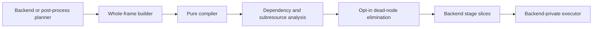

# Internal Render Graph Architecture

## Scope

This document defines the backend-internal shared Render Graph V2 intermediate
representation, whole-frame builder, analyzer, compiler, attempt tracker,
diagnostics, and integration boundaries used by WebGPU, WebGL, and
post-processing.

The implementation must remain internal. It must not add a public graph
registration API, expose native handles, allocate physical resources, assign
transient aliases, or emit native barriers. Software rendering may continue
without a backend whole-frame graph.

## Background

IgnisRenderer has three scheduling layers:

1. `RendererStageGraph` orders renderer-level `FramePass` stages.
2. WebGPU and WebGL planners expand each backend stage into backend-private
   nodes while `beginFrame()` builds and compiles one complete frame IR.
3. `PostProcessPlanner` resolves pass eligibility, scheduling, declarations,
   logical color versions, histories, and transients.
   `PostProcessSubgraphBuilder` converts the immutable plan into a local
   subgraph so each eligible pass becomes one outer `"post-process-pass"` node.

Before the shared graph layer, WebGPU, WebGL, and post-processing maintained
similar but separate
resource-lifetime and transition state machines. This duplicated rules for
inactive resources, optional access, destroy/recreate, and diagnostics. It
also made later whole-frame optimization difficult because the debug models
did not share one canonical resource vocabulary.

V2 makes the shared compiler authoritative for one complete GPU backend frame
while preserving planner order and backend ownership. The data flow is:



Logical transitions and allocation requests describe ordering and lifetime
facts. They are not WebGPU commands, WebGL state changes, native allocations,
or proof that a native barrier is required.

## API/Contract

### Layering and Ownership

- `src/rendergraph/` must remain backend-agnostic and `@internal`.
- Backend planners must retain backend-specific node kinds and payloads.
- Backend rules must validate capabilities that are not universal, including
  WebGL usage support and logical texture feedback.
- Backend executors must own command recording, state changes, presentation,
  and backend-specific pass execution.
- Backend managers and post-process pools must retain native allocation,
  destruction, pooling, and history ownership.
- The shared analyzer must not inspect native handles or native usage flags.
  It may compare opaque stable physical IDs supplied by the backend catalog.
- `Renderer`, `IRenderBackend`, `PostProcessPass`, and custom render-pass
  public contracts must not expose the shared graph.

### Logical IR

`RenderGraphResourceDescriptor` identifies one logical resource and must be a
discriminated texture, buffer, or external descriptor. Texture descriptors
must retain format, extent, dimension, layers, sample count, mip count, and
allowed usages when known. Buffer descriptors must retain byte size and
allowed usages when known. Imported external metadata may be incomplete, but
graph-owned allocatable resources must be complete.

`RenderGraphPhysicalBinding` must map one logical resource generation to a
stable backend-private `physicalId`. It must not contain a native handle.
Logical resources with the same physical ID must share dependency and hazard
analysis. V2 supports only full-resource physical bindings.

`RenderGraphResourceRef` must declare canonical access and usage. Optional
missing references must be ignored completely. Texture references may select
mip, layer, and aspect ranges. Buffer references may select byte ranges.
Omitted ranges mean the complete resource. Invalid or out-of-bounds ranges
must be enforced diagnostics.

`RenderGraphNode<TPayload, TKind>` must preserve backend node kinds and payloads
through generics. A node may declare `dependsOn`, `requires`, `creates`, ordered
resource references, `destroys`, execution `domain`, and retention policy.
Retention must default to `"always"`; only `"if-reachable"` nodes may be
removed by dead-node elimination.

Canonical usage mapping must be:

| Backend usage | Canonical usage |
| --- | --- |
| WebGPU `render-attachment` | `color-attachment` |
| WebGPU `texture-binding` | `sampled` |
| WebGPU `storage-binding` | `storage` |
| WebGL `framebuffer-color` | `color-attachment` |
| WebGL `framebuffer-depth` | `depth-attachment` |
| WebGL `texture-sampling` | `sampled` |
| `copy-src` or `copy-source` | `copy-source` |
| `copy-dst` or `copy-target` | `copy-target` |

`RenderGraphTransition` must retain logical resource generation, previous and
next node, previous and next access, previous and next usage, scope, and
RAW/WAR/WAW or usage-transition reason.

`RenderGraphLiveRange` must be keyed by `{ resourceId, generation }` and retain
create, first use, last use, and destroy node identities when present.
Subresource live ranges must additionally retain normalized texture or buffer
ranges. Live ranges are analysis data only.

Unbound graph-owned frame or transient generations must produce logical
allocation requests with compatibility keys and allocate-before/release-after
node IDs. Backends must not allocate or destroy native resources merely because
an allocation request exists.

### Whole-Frame Definition and Composition

`RenderGraphBuilder` must build immutable `RenderGraphDefinition` values from
resources, bindings, nodes, exports, and composed subgraphs. A subgraph must
declare named imports and exports. Composition must namespace all internal
resource and node IDs, remap declared ports to parent logical resources, and
diagnose missing ports or collisions. Callers may inject parent dependencies
into every local root node. The composition result must return complete node
and resource remap tables in addition to resolved named outputs.

WebGPU and WebGL must build the complete enabled backend frame graph during
`beginFrame()`. Synthetic setup and presentation nodes must be included.
`executePass()` must execute the already compiled stage slice and must not
invoke the planner or compiler again.

### Shared Analyzer

`RenderGraphAnalyzer` must be the only shared logical resource state machine.
Existence and content validity must be tracked separately. Hazard keys must use
physical identity when a binding is known and logical generation otherwise.
Only overlapping normalized subresources may produce hazards.

The logical lifecycle is `inactive -> active(generation) -> destroyed`.
Creating or implicitly reactivating an inactive resource must increment its
generation and clear transition state from the previous generation. A write to
an inactive resource may activate it for backend compatibility, but must emit
an `implicit-create` shadow diagnostic. An undeclared backend resource may get
a compatibility descriptor, but must emit an
`implicit-resource-declaration` shadow diagnostic.

The analyzer must retain resource-reference order inside a node so legacy
barrier projection stays stable. Backend validation rules must receive the
complete node before ordered access processing so feedback and conflict checks
can inspect the full access set.

Imported IDs supplied by current backend facades must be active and have
`initialContent: "unknown"`. Legacy validation must allow reads, while the
shared analysis emits `read-content-unknown` only as a shadow diagnostic.

### Pure Whole-Frame Compiler and Attempt Tracker

`RenderGraphCompiler.compile()` must be pure. Each call must create fresh state,
validate and normalize the definition, apply stable explicit ordering, infer
resource dependencies, run opt-in dead-node elimination, and analyze the
retained graph. Independent retained nodes must preserve declaration order.
The immutable result must expose declared, retained, and culled nodes; stage
slices; explicit and inferred dependencies; transitions; logical and
subresource live ranges; bindings; allocation requests; exports; completeness;
and separate enforced and shadow diagnostics.

Dead-node elimination must seed reachability from graph exports and every node
whose retention is `"always"`. It must traverse explicit and inferred
predecessors. It must not run when enforced compile errors exist. V2 does not
perform dead-store elimination.

`RenderGraphAttemptTracker` must retain one precompiled attempt and preserve the
compiler's stable order. Its lifecycle is:

```text
idle -> active -> sealed -> committed
                       \-> aborted
active -----------------> aborted
```

The tracker API is `begin(compiledGraph)`, `seal()`, `commit()`, `abort(error?)`,
and `getDebugState()`. A new frame may begin after a committed or aborted
attempt. `RenderGraphStateTracker` remains a legacy compatibility adapter and
must not be the GPU backend production compiler.

`current` must exist only for an active or sealed compiled attempt.
`lastAttempt` must retain the latest committed or aborted attempt.
`lastSuccessful` must change only after backend execution, submission,
presentation, post-process history, custom-target publication, and deferred
lifecycle work all commit.

Each attempt snapshot must include a frozen `executionOverlay`. Its
`skippedNodeIds` records retained nodes that returned `{ ran: false }`, and its
`resourceAliases` maps planned logical outputs to the logical resource actually
used. Planned transitions and live ranges must remain unchanged. Overlay
mutation is valid only while the attempt is active; mutation after `seal()`
must fail.

### Backend Facades and Diagnostics

`WebGPUFrameGraphCompiler` and `WebGLFrameGraphCompiler` must compile one
whole-frame definition. Any legacy stage or barrier debug views must be derived
from that compiled graph and must not re-run analysis.

Backend debug state must additionally expose grouped `graphAnalysis` state.
Shadow diagnostics must appear only in
`graphAnalysis.current.shadowDiagnostics`,
`graphAnalysis.lastAttempt.shadowDiagnostics`, or
`graphAnalysis.lastSuccessful.shadowDiagnostics`. They must not enter legacy
diagnostic arrays, trigger `Logger`, stop node execution, or be controlled by
WebGPU `frameGraphValidation`.

WebGL rules must continue enforcing `requires`, supported usage, and feedback
on the same logical texture ID. WebGPU must continue applying `"throw"` or
`"warn"` only to enforced legacy validation errors.

`graphBarriers` and canonical transitions are diagnostic records. V2 must not
add native WebGPU barrier commands or treat WebGL state changes as shared
lowering.

### Flattened Post-Process and Opaque Coverage

WebGPU and WebGL must compose post-processing into the authoritative
whole-frame definition under the `"postprocess"` namespace. The GPU runtime
must compile post-process eligibility and order once during `beginFrame()` and
must not compile a nested shared graph. Every retained pass must be an
always-retained `"post-process-pass"` node executed in outer compiled order.
Software consumes the logical post-process plan directly. Standalone tests may
compile a produced subgraph explicitly, but production runtimes must not expose
or invoke a nested shared-compiler helper.

Post-process pass eligibility, deterministic ordering, planned color versions,
resolved color aliases for `{ ran: false }`, transient descriptors, and history
descriptors must come from one execution declaration. A successful pass must
commit the output assigned to its logical color version automatically. History
swaps must remain deferred
until complete backend-frame success; abort must discard pending history
writes. A skipped pass must record its outer node ID and namespaced color alias
in the attempt execution overlay without changing later passes' physical source
texture.

Logical post-process transient and color-version resources must be graph-owned
descriptors. History resources remain backend-owned imported logical resources
and must not become parent composition ports. Native pools, ping-pong targets,
history managers, allocation, barriers, and alias ownership remain outside the
shared graph.

Custom render-target passes, particle simulation, and other paths that bypass
backend graph executors must be represented by always-retained opaque
placeholder nodes. The attempt must be marked `"opaque"` and emit
`opaque-stage-effects` as a shadow diagnostic without changing native
execution.

### Future Integration Boundary

The completed V2 foundation establishes descriptors, bindings, post-process
composition, whole-frame compilation, DCE, and logical allocation requests.
Future changes should proceed in this order:

1. A backend allocator may consume allocation requests and assign compatible
   transient aliases without transferring native ownership to Render Graph.
2. Pass merging may be introduced after stage-slice debug and failure
   boundaries are preserved.
3. Backend-specific synchronization lowering, physical feedback validation,
   and multi-domain scheduling may be introduced only after physical bindings
   are explicit.

No speculative lowerer API should be added before the physical resource model
exists.

## Usage

The whole-graph compiler is appropriate for a complete logical subgraph:

```ts
const compiled = new RenderGraphCompiler().compile({
	resources,
	nodes,
});
```

GPU backends must compile the complete frame in `beginFrame()` and consume only
the precompiled slice during execution:

```ts
const frame = compiler.compileFrame(framePlan);
const stage = frame.stages.find((entry) => entry.pass.stage === pass.stage);
executeNodes(stage?.nodes ?? []);
compiler.seal();

// Only after all backend and history transactions succeed.
compiler.commit();
```

Validation commands are:

```bash
bun tests/static/renderer/test_render_graph_state_tracker.mjs
bun tests/static/renderer/test_render_graph_v2.mjs
bun tests/static/webgpu/test_webgpu_frame_graph_compiler.mjs
bun tests/static/webgl/test_webgl_frame_graph_compiler.mjs
bun tests/static/webgl/test_webgl_frame_graph_runtime.mjs
bunx tsc --noEmit
```

## Errors & Diagnostics

Enforced diagnostics preserve current execution policy:

| Code | Meaning |
| --- | --- |
| `duplicate-node` | A whole graph declares the same node ID twice. |
| `duplicate-resource` | A whole graph declares the same resource ID twice. |
| `physical-descriptor-conflict` | Logical aliases bound to one physical ID have incompatible descriptors. |
| `invalid-subresource-range` | A texture or buffer range is invalid or outside its descriptor. |
| `missing-dependency` | A required topological dependency is absent. |
| `cycle` | Whole-graph dependencies are cyclic. |
| `read-before-create` | A required read references an inactive resource. |
| `duplicate-create` | A node creates an active resource. |
| `destroy-before-create` | A node destroys an inactive resource. |
| `missing-resource` | A backend rule requires an unavailable resource. |
| `unsupported-node-resource` | WebGL cannot support a declared usage. |
| `texture-feedback-loop` | WebGL samples and writes one logical texture. |

Shadow diagnostics add observation without changing execution:

| Code | Meaning |
| --- | --- |
| `implicit-resource-declaration` | A backend node used an undeclared ID. |
| `implicit-create` | A write activated an inactive logical resource. |
| `read-content-unknown` | An imported resource was readable but its producer was not modeled. |
| `read-before-initialize` | An active resource had undefined logical content. |
| `use-after-destroy` | Analysis observed access after logical destruction. |
| `opaque-stage-effects` | A backend path executed without resource-effect metadata. |
| `external-metadata-unknown` | Backend-owned external metadata cannot be validated. |

Every shared diagnostic must identify phase, enforcement, severity, code,
message, and available stage, node, resource, and backend context. Shadow
diagnostics must never be logged by compatibility facades.

## Compatibility / Breaking Changes

Whole-frame post-process composition changes the internal GPU custom-pass
contract. Planner order, actual command order, presentation, native allocation,
destruction, post-process eligibility, color resolution, history ownership, and
public Render Graph APIs remain unchanged.

The permitted internal debug differences are:

- transitions include generation, previous usage, and previous node;
- optional missing references do not appear in shared live ranges or
  transitions;
- destroy/recreate uses separate generations and cannot inherit a false hazard;
- grouped `graphAnalysis` exposes canonical transitions, live ranges,
  completeness, and shadow diagnostics.

Every backend implementation must provide one complete execution declaration.
Graph metadata, context-binding metadata, and Software compatibility profiles
are removed. Missing or incomplete declarations fail planning. Moving native
ownership, assigning physical transient aliases, emitting native barriers, or
merging passes remains outside this change.
