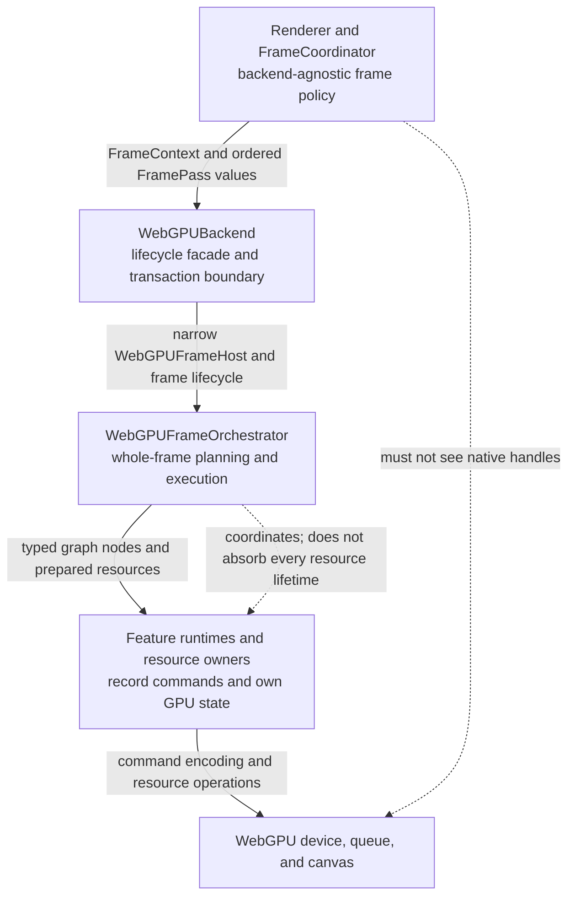
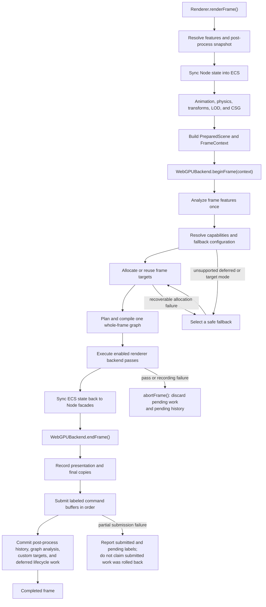
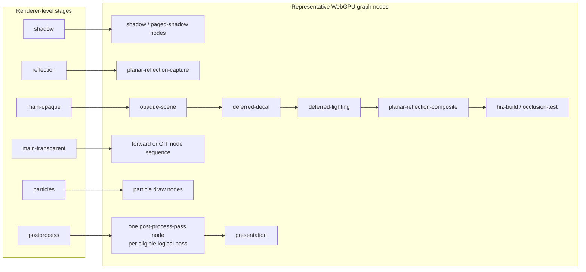
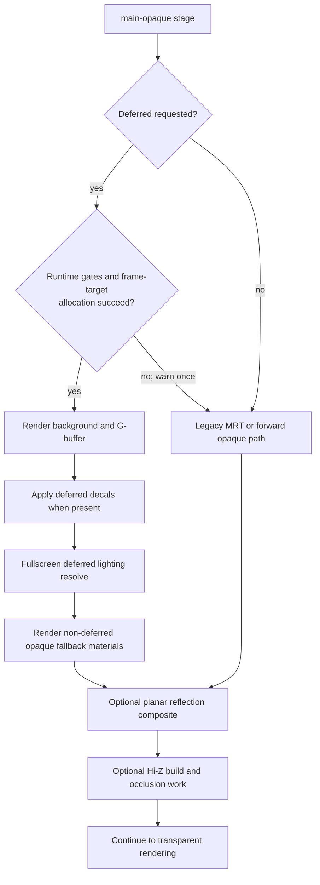
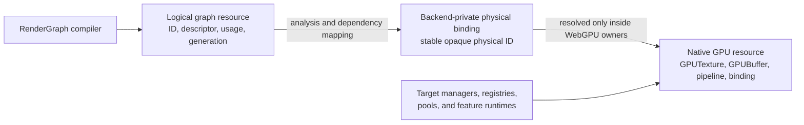

# WebGPU Rendering Pipeline Architecture

## Scope

This document explains how one renderer frame becomes WebGPU work, which
subsystem owns each decision, and where contributors should place new WebGPU
rendering behavior.

It covers the boundary between the renderer pipeline, `WebGPUBackend`, the
backend-internal frame graph, feature runtimes, GPU resource owners,
post-processing, command submission, and frame commit. Detailed behavior
remains normative in the linked contract documents.

## Background

IgnisRenderer deliberately uses two scheduling levels:

1. The renderer-level `RendererStageGraph` orders backend-agnostic simulation,
   scene preparation, and `FramePass` stages.
2. The WebGPU-internal Render Graph expands enabled backend stages into
   WebGPU-specific nodes and resource dependencies.

The separation lets Software, WebGL, and WebGPU share the same public rendering
facade without forcing their implementations to use the same native pass
structure. For example, renderer-level `main-opaque` is one stage, while WebGPU
may expand it into G-buffer rendering, deferred decals, deferred lighting,
Hi-Z construction, planar reflection composition, and paged-shadow feedback.

The architecture can be read as four layers:



The key rule is that ordering, execution, and resource ownership are related
but different responsibilities. A graph node describes when work runs and what
logical resources it accesses. The feature runtime records the actual commands.
The appropriate manager, registry, pool, or feature service owns the native GPU
resource lifetime.

## API/Contract

### End-to-End Frame Flow

The following diagram shows the normal frame path. The `sync-out` stage occurs
after backend pass execution, but WebGPU submission and transactional commit
occur only when `FrameCoordinator` subsequently calls `endFrame()`.



The major steps are:

1. `FrameCoordinator` owns renderer-level stage ordering, ECS synchronization,
   simulation, prepared-scene construction, and creation of `FrameContext`.
2. `WebGPUBackend.beginFrame()` establishes the backend transaction, advances
   frame-scoped caches, binds the post-process session, and delegates internal
   frame construction to `WebGPUFrameOrchestrator`.
3. `WebGPUFrameFeatureAnalyzer` scans required scene and post-process work once.
   It reports desired work without applying device fallbacks.
4. `WebGPUFrameConfigurationResolver` applies device limits, effective feature
   configuration, and fallback policy.
5. `WebGPUFrameTargetManager` allocates or reuses offscreen targets. It owns
   target textures and allocation retry results, not orchestration policy.
6. `WebGPUFrameGraphPlanner` expands renderer stages into WebGPU graph nodes.
   `WebGPUFrameGraphCompiler` compiles the complete frame before pass execution.
7. `executePass()` consumes the precompiled slice for the matching renderer
   stage. Node executors route each node kind to its feature runtime.
8. `WebGPUFrameCommitter` retains labeled command buffers and submits them in
   recording order during `endFrame()`.
9. Post-process history and graph analysis commit only after all required
   backend work succeeds.

### Renderer Stages and WebGPU Expansion

The renderer pipeline defines portable intent. The WebGPU graph defines the
backend-private implementation of that intent.



This mapping is intentionally not one-to-one:

- `main-opaque` may use deferred or forward rendering according to resolved
  runtime configuration.
- Transparent rendering may use direct forward nodes or an OIT sequence that
  separately prepares, clears, accumulates, resolves, and handles transmission.
- Post-processing retains logical pass order from `PostProcessPlanner`, but GPU
  execution is flattened into the authoritative whole-frame graph.
- Particle simulation and custom render-target callbacks may execute outside
  graph node executors. They must be represented by opaque placeholder nodes so
  graph diagnostics report incomplete resource-effect coverage honestly.
- Presentation is an explicit WebGPU finalization node, not a renderer-level
  pass shared with Software or WebGL.

### `main-opaque` Decision Path

Deferred lighting is an internal implementation choice and must not create
renderer-level stages:



Deferred lighting currently requires single-sample rendering, MRT support,
sufficient color attachment capacity and bytes per sample, and sufficient
storage textures. Transparent materials, transmission, OIT, and transparent
particles remain on forward paths after opaque lighting.

### Responsibility Boundaries

| Owner                             | Owns                                                                                                                                                                  | Must not own or expose                                                                          |
| --------------------------------- | --------------------------------------------------------------------------------------------------------------------------------------------------------------------- | ----------------------------------------------------------------------------------------------- |
| `Renderer` / `FrameCoordinator`   | Public facade, renderer stage order, ECS sync, simulation scheduling, prepared scene, `FrameContext`                                                                  | WebGPU device lifecycle, native handles, WebGPU-internal node kinds                             |
| `WebGPUBackend`                   | One-renderer attachment, device and canvas lifecycle, frame transaction entrypoints, device loss, extension registry, final commit/abort coordination                 | Public forwarding methods for native WebGPU resources, feature-specific pass internals          |
| `WebGPUFrameHost`                 | Narrow device-scoped access to resources, canvas, command recording, submission, validation, and post-process runtime                                                 | Full `WebGPUBackend` lifecycle facade or policy unrelated to frame execution                    |
| `WebGPUFrameOrchestrator`         | One active frame session, analysis/configuration sequence, target retry coordination, whole-frame graph composition, stage-slice execution, presentation finalization | Texture-pool allocation logic, all feature resource lifetimes, direct command-buffer submission |
| `WebGPUFrameGraphPlanner`         | Mapping enabled renderer stages to ordered WebGPU nodes and declared logical accesses                                                                                 | Native command recording, native allocation, renderer-level stage registration                  |
| `WebGPUFrameGraphCompiler`        | Whole-frame ordering, dependencies, logical transitions, live ranges, diagnostics, stage slices                                                                       | Native barriers, native handles, physical texture ownership                                     |
| `WebGPUFrameNodeExecutorRegistry` | Exhaustive node-kind-to-executor dispatch                                                                                                                             | Planning policy or silent fallback for missing executors                                        |
| Feature runtimes                  | Actual shadow, scene, deferred, transparency, reflection, visibility, post-process, and presentation command recording; pass-local pipelines and bindings             | Global renderer stages or unrelated feature lifetimes                                           |
| `WebGPUFrameServiceOwner`         | Device-lifetime shared scene, geometry, texture, material, shadow, deferred, and particle-render services; frame resource scopes                                      | Full backend lifecycle, canvas presentation policy, frame-target textures                       |
| `WebGPUFrameTargetManager`        | Offscreen frame, G-buffer, Hi-Z, OIT, and related target allocation or pooled ownership                                                                               | Feature detection, fallback policy, orchestrator state                                          |
| `BackendPostProcessRuntime`       | One logical post-process plan, eligibility, declarations, histories, transients, and transactional history commit                                                     | Nested GPU graph compilation or native WebGPU pass dispatch by pass ID                          |
| `WebGPUFrameCommitter`            | Labeled command-buffer retention and ordered submission                                                                                                               | Recording feature commands or rolling back already submitted work                               |

### Resource Ownership Model

Contributors should distinguish three resource views:



- The shared Render Graph owns logical descriptions and analysis.
- Backend resource catalogs may associate logical resources with stable opaque
  physical IDs, but graph data must not contain native handles.
- Frame-target managers, registries, resource managers, pools, or feature
  runtimes own creation, reuse, invalidation, and destruction of native state.
- A logical allocation request is analysis output. It does not itself allocate
  or destroy a GPU resource.
- Resources with native or backend state must have an explicit, idempotent
  destruction path at their owning layer.

### Post-Processing Boundary

`Renderer` owns the public `renderer.postProcess` registry. The backend owns
execution.

`BackendPostProcessRuntime` must create one deterministic plan per frame and
retain each implementation's execution declaration. WebGPU uses those
declarations before frame-target allocation, finalizes availability after
allocation, and composes eligible passes into the whole-frame graph. Each
eligible pass becomes a namespaced `"post-process-pass"` node.

`WebGPUPostProcessBridge` provides declaration-checked access to frame textures
and shared services. Pass implementations must request declared logical
resources; they must not reach into `WebGPUFrameOrchestrator` or receive native
device and queue handles.

History swaps and planned color-version commits remain pending until the entire
backend frame succeeds. A skipped post-process pass records an execution
overlay alias instead of rewriting the compiled graph.

### Lifecycle and Failure Boundaries

The backend and orchestrator must maintain one active frame at a time:

```text
no session -> recording -> committing -> cleared
          \-> skipped -----------> cleared
          \-> aborted -----------> cleared
```

- `beginFrame()` must reject a concurrent active session.
- `executePass()` must receive the same `FrameContext` object used by
  `beginFrame()`.
- A zero-sized frame may use a skipped session without an encoder, while still
  preserving the lifecycle.
- Before submission, `abortFrame()` may discard pending encoders, command
  buffers, post-process history writes, and unpublished custom-target state.
- After partial submission, the backend must report submitted and pending
  command labels. It must not describe already submitted GPU work as rolled
  back.
- Device loss must destroy backend-owned post-process state before invalidating
  the frame host and shared GPU resources.
- A `WebGPUBackend` instance attaches to at most one `Renderer`. Another
  renderer requires another backend instance.

### Placement Guide for New Work

Use the narrowest owning layer:

| Change                                                     | Primary location                                                                     |
| ---------------------------------------------------------- | ------------------------------------------------------------------------------------ |
| New portable renderer stage or cross-backend ordering rule | `src/pipeline/` and renderer contracts                                               |
| New WebGPU-only step inside an existing renderer stage     | `src/backends/webgpu/rendergraph/` planner, node kind, executor, and feature runtime |
| New pass-owned cross-backend post-process effect           | `src/postprocess/passes/` with backend execution declarations                        |
| New WebGPU shader                                          | `src/shaders/webgpu/`                                                                |
| New frame-sized WebGPU target                              | `WebGPUFrameTargetManager` and the typed graph resource catalog                      |
| New device-lifetime scene or feature resource              | `WebGPUFrameServiceOwner` or a delegated registry/runtime                            |
| New public optional backend capability                     | A typed backend extension, without native handles                                    |
| New graph diagnostic or logical dependency rule            | `src/rendergraph/` only when backend-agnostic; otherwise the WebGPU graph facade     |

When a new WebGPU graph node kind is added, the planner, logical resource
declarations, exhaustive executor registry, feature runtime, diagnostics, and
target ownership must be reviewed together.

## Usage

Start architecture work from the following implementation points:

- `src/rendering/FrameCoordinator.ts` for renderer-level execution.
- `src/pipeline/defaultPipeline.ts` for built-in renderer stages.
- `src/backends/webgpu/WebGPUBackend.ts` for backend lifecycle.
- `src/backends/webgpu/rendergraph/WebGPUFrameOrchestrator.ts` for internal
  frame coordination.
- `src/backends/webgpu/rendergraph/WebGPUFrameGraphPlanner.ts` for stage
  expansion.
- `src/backends/webgpu/rendergraph/WebGPUFrameNodeRuntimes.ts` and
  `WebGPUFrameNodeExecutorRegistry.ts` for execution dispatch.
- `src/backends/webgpu/WebGPUFrameServiceOwner.ts` for shared resource
  composition.
- `src/postprocess/BackendPostProcessRuntime.ts` for logical post-process
  planning and transaction ownership.

Read these normative references before changing the corresponding behavior:

- [Engine architecture](engine-architecture.md)
- [Rendering pipeline and shader contracts](rendering-pipeline-and-shader-contracts.md)
- [Internal Render Graph architecture](internal-render-graph-architecture.md)
- [Renderer and backend core contract](../contracts/core/renderer-contract.md)
- [WebGPU internal frame graph contract](../contracts/rendering/backends/webgpu/webgpu-internal-frame-graph-contract.md)
- [WebGPU deferred lighting contract](../contracts/rendering/backends/webgpu/webgpu-deferred-lighting-contract.md)
- [Post-process backend execution contract](../contracts/rendering/postprocess/backend-execution-contract.md)
- [Post-process cross-backend contract](../contracts/rendering/postprocess/cross-backend-contract.md)

Relevant validation commands are:

```bash
bun tests/static/webgpu/test_webgpu_frame_graph_compiler.mjs
bun tests/static/webgpu/test_webgpu_frame_graph_planner.mjs
bun tests/static/webgpu/test_webgpu_frame_node_executor_registry.mjs
bun tests/static/webgpu/test_webgpu_frame_executor_resilience.mjs
bun tests/static/webgpu/test_webgpu_post_graph.mjs
bunx tsc --noEmit
```

## Errors & Diagnostics

Use the failing layer to narrow investigation:

| Symptom                                | First owner to inspect                                                                        |
| -------------------------------------- | --------------------------------------------------------------------------------------------- |
| Wrong cross-backend stage order        | `RendererStageGraph`, pipeline registration, or `FrameCoordinator`                            |
| WebGPU stage has no work               | `WebGPUFrameGraphPlanner` registration and feature analysis                                   |
| Planned node has no executor           | `WebGPUFrameNodeExecutorRegistry` and feature runtime registration                            |
| Deferred path unexpectedly falls back  | `WebGPUFrameConfigurationResolver`, device limits, and target allocation result               |
| Logical read/write or lifetime error   | Whole-frame graph diagnostics and typed resource catalog                                      |
| Correct graph but incorrect GPU output | Feature runtime, shader, bindings, and concrete target ownership                              |
| Post-process pass is skipped           | Retained execution declaration, availability finalization, and resource accessor              |
| Frame fails during submission          | `WebGPUFrameCommitter` submitted and pending command labels                                   |
| Last successful graph state is stale   | Backend transaction did not complete every submit, publication, history, and lifecycle commit |

Enforced graph diagnostics may stop the frame according to
`frameGraphValidation`. Shadow diagnostics describe incomplete or compatibility
modeling and must remain in grouped graph-analysis debug state without changing
execution.

## Compatibility / Breaking Changes

This document describes the current internal architecture and does not add a
public API.

Changes to renderer-level stage order, backend lifecycle, WebGPU graph node
ordering, shader or G-buffer layouts, post-process ownership, resource lifetime,
presentation, or transaction commit semantics may be breaking changes. Such
changes must update their normative contract documents, regression tests, and
migration guidance in the same change.

WebGPU-only internal expansion must not add equivalent global stages to
Software or WebGL. Native WebGPU handles must remain private to the backend, and
the shared Render Graph must remain a logical analysis and scheduling layer
rather than a native allocation or synchronization owner.
