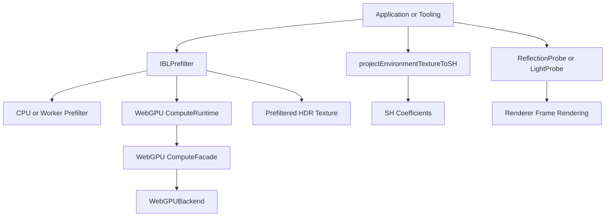

# IBL Prefilter Contract
## Scope
This document defines the standalone environment IBL prefilter contract.
The contract covers `IBLPrefilter`, `prefilterEnvironmentIBL`,
`projectEnvironmentTextureToSH`, backend selection, output texture shape, and
ownership boundaries with `Renderer`.

## Background
Environment specular prefiltering is independent from frame rendering.
`Renderer` must not schedule, own, or configure IBL prefilter work. Applications
and tooling must invoke `IBLPrefilter` or `prefilterEnvironmentIBL` explicitly
for specular IBL textures, invoke `projectEnvironmentTextureToSH` explicitly for
diffuse SH coefficients, then assign the resulting data to probes.



## API/Contract
- `IBLPrefilter` must accept an optional `IRenderBackend`, `WebGPUBackend`, or
  `IWebGPUComputeFacade` source at construction time.
- The `IBLPrefilter` constructor must accept only an
  `IBLPrefilterBackendSource` or `null`; constructor option wrapper objects must
  not be supported.
- When an `IRenderBackend` is provided, `IBLPrefilter` must resolve WebGPU
  acceleration through `WEBGPU_COMPUTE_EXTENSION` and must not inspect or cast
  the backend to a concrete backend class.
- `IBLPrefilter` must use the resolved compute facade only when its device and
  queue are available. It must not attach, initialize, restore, or destroy the
  provided backend.
- `IBLPrefilter.prefilter(envMap, options)` must return an HDR `Texture` whose
  `mipmaps` encode roughness levels.
- Equirectangular input and output directions must use
  `phi = u * 2 * PI - PI` and `theta = v * PI`, matching runtime and shader
  environment sampling.
- Prefiltered equirectangular output must use horizontal repeat and vertical
  clamp addressing. Sampling across the longitude seam may wrap, while the
  north and south poles must not wrap into each other.
- `prefilterEnvironmentIBL(envMap, options)` must provide a one-shot helper with
  the same behavior as constructing `IBLPrefilter` and calling `prefilter`.
- `projectEnvironmentTextureToSH(envMap, options)` must project a valid
  environment texture into radiance SH coefficients and must not prefilter
  specular IBL data.
- `IBLPrefilterOptions` must use `maxSampleWidth`, `maxSampleHeight`, and
  `maxMipLevels` for output limits.
- `IBLPrefilterOptions.acceleration` must support `auto`, `single-thread`,
  `multi-thread`, and `webgpu`.
- `single-thread` must execute prefiltering synchronously on the calling
  JavaScript thread. `multi-thread` must distribute mip work through the Worker
  scheduler.
- If `acceleration` is `webgpu`, a direct WebGPU compute source or an
  `IRenderBackend` exposing `WEBGPU_COMPUTE_EXTENSION` must be provided.
- If `acceleration` is `auto`, WebGPU may be used when a valid WebGPU source is
  available and ready; otherwise multi-thread or single-thread fallback may be
  used.
- If `acceleration` is `webgpu`, an `IRenderBackend` without the WebGPU compute
  extension or with an unavailable WebGPU device or queue must cause a
  descriptive error.
- `IBLPrefilter` and `prefilterEnvironmentIBL` must not resolve `Renderer`
  instances or renderer-like `{ backend }` wrappers as compute sources.
- `Renderer` must not expose environment IBL prefilter or update methods.
- `Renderer.warmup()` must not create `LightProbe` instances, assign
  `LightProbe.sh`, or assign `ReflectionProbe.prefilteredMap`.

## Usage
```ts
const prefilter = new IBLPrefilter(renderBackend);
const prefilteredMap = await prefilter.prefilter(environmentTexture, {
	acceleration: "auto",
	maxSampleWidth: 128,
	maxSampleHeight: 64,
	maxMipLevels: 5,
});

reflectionProbe.prefilteredMap = prefilteredMap;
reflectionProbe.markRuntimeDirty();
```

```ts
const sh = projectEnvironmentTextureToSH(environmentTexture, {
	maxSampleWidth: 128,
	maxSampleHeight: 64,
});

const prefilteredMap = await prefilterEnvironmentIBL(environmentTexture, {
	backend: webgpuBackend,
	acceleration: "auto",
	maxSampleWidth: 128,
	maxSampleHeight: 64,
	maxMipLevels: 5,
});

lightProbe.sh = sh;
reflectionProbe.prefilteredMap = prefilteredMap;
```

```bash
bun tests/static/lighting/test_ibl_prefilter.mjs
```

## Errors & Diagnostics
- `IBLPrefilter.prefilter()` must throw when `envMap` is not a valid 2D
  equirectangular texture or cubemap.
- `IBLPrefilter.prefilter()` must throw an `AbortError` when `signal` is
  aborted.
- Explicit `webgpu` acceleration must throw when no `WebGPUBackend` or
  `IWebGPUComputeFacade` source is available.
- Explicit `multi-thread` acceleration must throw when the Worker API is
  unavailable.

## Compatibility / Breaking Changes
This change is breaking.
`Renderer.setEnvironmentIBLUpdateOptions()`,
`Renderer.getEnvironmentIBLUpdateOptions()`,
`Renderer.requestEnvironmentIBLUpdate()`, `WarmupOptions.environmentIBLBake`,
`WarmupOptions.includeEnvironmentIBLBake`,
`bakeEnvironmentIBLFromEnvironmentMap()`, and `EnvironmentIBLBake*` types are
removed. Consumers must use `projectEnvironmentTextureToSH` for SH data and
`IBLPrefilter` or `prefilterEnvironmentIBL` for specular prefilter textures.
`Renderer` instances and renderer-like `{ backend }` wrappers are no longer
accepted as compute sources. Consumers may pass an `IRenderBackend`, a direct
`WebGPUBackend`, an `IWebGPUComputeFacade`, or a compatible
`WebGPUComputeFacadeSource`.
The `cpu` and `worker` acceleration values are replaced by `single-thread` and
`multi-thread`, respectively.
`IBLPrefilterConstructorOptions` is removed. Consumers must pass an
`IBLPrefilterBackendSource` directly to the `IBLPrefilter` constructor and keep
per-call settings in `IBLPrefilterOptions`.
