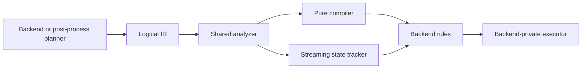

# Internal Render Graph Architecture

## Scope

This document defines the backend-internal shared Render Graph intermediate
representation, analyzer, pure compiler, streaming state tracker, diagnostics,
and integration boundaries used by WebGPU, WebGL, and post-processing.

The V1 implementation must remain internal. It must not add a public graph
registration API, expose native handles, flatten post-process passes into
renderer-level stages, allocate physical resources, or emit native barriers.
Software rendering may continue without the shared streaming tracker.

## Background

IgnisRenderer has three scheduling layers:

1. `RendererStageGraph` orders renderer-level `FramePass` stages.
2. WebGPU and WebGL planners expand each backend stage into backend-private
   nodes and execute those nodes immediately.
3. `PostProcessGraphCompiler` resolves pass eligibility, ordering, logical
   color versions, histories, and transients inside one outer
   `"postprocess"` backend node.

Before V1, WebGPU, WebGL, and post-processing maintained similar but separate
resource-lifetime and transition state machines. This duplicated rules for
inactive resources, optional access, destroy/recreate, and diagnostics. It
also made later whole-frame optimization difficult because the debug models
did not share one canonical resource vocabulary.

V1 extracts logical analysis without changing planner order or backend
ownership. The data flow is:



Logical transitions describe ordering facts. They are not WebGPU commands,
WebGL state changes, or proof that a native barrier is required.

## API/Contract

### Layering and Ownership

- `src/rendergraph/` must remain backend-agnostic and `@internal`.
- Backend planners must retain backend-specific node kinds and payloads.
- Backend rules must validate capabilities that are not universal, including
  WebGL usage support and logical texture feedback.
- Backend executors must own command recording, state changes, presentation,
  and backend-specific pass execution.
- Backend managers and post-process pools must retain native allocation,
  destruction, pooling, and history ownership.
- The shared analyzer must not inspect native handles, native usage flags, or
  physical alias identities.
- `Renderer`, `IRenderBackend`, `PostProcessPass`, and custom render-pass
  public contracts must not expose the shared graph.

### Logical IR

`RenderGraphResourceDescriptor` identifies one logical resource. Descriptors
must support:

- `id`, `kind`, and `origin`;
- `residency` values `"external"`, `"frame"`, `"transient"`, or `"history"`;
- `initialContent` values `"valid"`, `"undefined"`, or `"unknown"`;
- optional format, dimensions, and mip metadata.

`RenderGraphResourceRef` must declare canonical access and usage. Optional
missing references must be ignored completely: they must not create resource
state, transitions, live ranges, or diagnostics. A subresource range may be
retained for later analysis, but V1 evaluates the whole logical resource.

`RenderGraphNode<TPayload, TKind>` must preserve backend node kinds and payloads
through generics. A node may declare `dependsOn`, `requires`, `creates`, ordered
resource references, `destroys`, and a future-facing execution `domain`.

Canonical usage mapping must be:

| Backend usage | Canonical usage |
| --- | --- |
| WebGPU `render-attachment` | `color-attachment` |
| WebGPU `texture-binding` | `sampled` |
| WebGPU `storage-binding` | `storage` |
| WebGL `framebuffer-color` | `color-attachment` |
| WebGL `framebuffer-depth` | `depth-attachment` |
| WebGL `texture-sampling` | `sampled` |
| `copy-src` or `copy-source` | `copy-source` |
| `copy-dst` or `copy-target` | `copy-target` |

`RenderGraphTransition` must retain logical resource generation, previous and
next node, previous and next access, previous and next usage, scope, and
RAW/WAR/WAW or usage-transition reason.

`RenderGraphLiveRange` must be keyed by `{ resourceId, generation }` and retain
create, first use, last use, and destroy node identities when present. It is
analysis data only and must not cause allocation or destruction.

### Shared Analyzer

`RenderGraphAnalyzer` must be the only shared resource state machine used by
the pure compiler and streaming tracker. Existence and content validity must be
tracked separately.

The logical lifecycle is `inactive -> active(generation) -> destroyed`.
Creating or implicitly reactivating an inactive resource must increment its
generation and clear transition state from the previous generation. A write to
an inactive resource may activate it for backend compatibility, but must emit
an `implicit-create` shadow diagnostic. An undeclared backend resource may get
a compatibility descriptor, but must emit an
`implicit-resource-declaration` shadow diagnostic.

The analyzer must retain resource-reference order inside a node so legacy
barrier projection stays stable. Backend validation rules must receive the
complete node before ordered access processing so feedback and conflict checks
can inspect the full access set.

Imported IDs supplied by current backend facades must be active and have
`initialContent: "unknown"`. Legacy validation must allow reads, while the
shared analysis emits `read-content-unknown` only as a shadow diagnostic.

### Pure Compiler and Streaming Tracker

`RenderGraphCompiler.compile()` must be pure. Each call must create fresh
analysis state, apply stable topological ordering, and return immutable output.
Independent nodes must retain declaration order. Duplicate nodes or resources,
missing dependencies, and cycles must be enforced diagnostics.
The result must expose enforced `diagnostics` and `shadowDiagnostics` as
separate arrays.

`RenderGraphStateTracker` must preserve append order and must not reorder nodes
across or within stages. Its lifecycle is:

```text
idle -> active -> sealed -> committed
                       \-> aborted
active -----------------> aborted
```

The tracker API is `beginFrame(resources)`, `appendStage(plan)`, `seal()`,
`commit()`, `abort(error?)`, and `getDebugState()`. A new frame may begin after
a committed or aborted attempt.

`current` must exist only for an active or sealed attempt. `lastAttempt` must
retain the latest committed or aborted attempt. `lastSuccessful` must change
only after backend execution, submission, presentation, post-process history,
custom-target publication, and deferred lifecycle work all commit.

### Backend Facades and Diagnostics

`WebGPUFrameGraphCompiler` and `WebGLFrameGraphCompiler` must remain
compatibility facades. They must project canonical transitions back to the
legacy `graphBarriers` shape and preserve `compiledStages`, `graphResources`,
`graphBarriers`, and `graphDiagnostics`.

Backend debug state must additionally expose grouped `graphAnalysis` state.
Shadow diagnostics must appear only in
`graphAnalysis.current.shadowDiagnostics`,
`graphAnalysis.lastAttempt.shadowDiagnostics`, or
`graphAnalysis.lastSuccessful.shadowDiagnostics`. They must not enter legacy
diagnostic arrays, trigger `Logger`, stop node execution, or be controlled by
WebGPU `frameGraphValidation`.

WebGL rules must continue enforcing `requires`, supported usage, and feedback
on the same logical texture ID. WebGPU must continue applying `"throw"` or
`"warn"` only to enforced legacy validation errors.

`graphBarriers` and canonical transitions are diagnostic records. V1 must not
add native WebGPU barrier commands or treat WebGL state changes as shared
lowering.

### Nested and Opaque Coverage

Post-processing must remain one outer backend graph node in V1.
`BackendPostProcessRuntime` may compile its internal logical subgraph with the
pure compiler, but the backend streaming snapshot must mark coverage as
`"coarse"` when post-processing runs.

Post-process pass eligibility, deterministic ordering, planned color versions,
resolved color aliases for `{ ran: false }`, transient descriptors, and history
descriptors must not change. A successful pass may publish only the output
selected for its logical color version. History swaps must remain deferred
until complete backend-frame success; abort must discard pending history
writes.

Custom render-target passes, particle simulation, and other paths that bypass
backend graph nodes must keep their current execution path. The tracker must
mark the frame `"opaque"` and emit `opaque-stage-effects` as a shadow diagnostic
without changing legacy resource state.

### Future Integration Boundary

Future changes should proceed in this order:

1. Backend resource catalogs provide complete descriptors and a separate
   physical binding table.
2. Post-process exports its ordered subgraph through explicit imports, exports,
   and resolved logical color versions.
3. Backends construct one complete frame IR before execution.
4. Analysis adds subresource live ranges, transient aliasing, dead-node
   elimination, and pass merging.
5. Custom passes may provide optional logical resource-effect metadata;
   undeclared effects remain opaque.
6. Backend-specific synchronization lowering, physical feedback validation,
   and multi-domain scheduling may be introduced only after physical bindings
   are explicit.

No speculative lowerer API should be added before the physical resource model
exists.

## Usage

The whole-graph compiler is appropriate for a complete logical subgraph:

```ts
const compiled = new RenderGraphCompiler().compile({
	resources,
	nodes,
});
```

Backend stage-by-stage execution must use the streaming tracker through its
compatibility facade:

```ts
compiler.beginFrame(initialResourceIds);
const compiledStage = compiler.compileStage(stagePlan);
executeNodes(compiledStage.nodes);
compiler.seal();

// Only after all backend and history transactions succeed.
compiler.commit();
```

Validation commands are:

```bash
bun tests/static/renderer/test_render_graph_state_tracker.mjs
bun tests/static/webgpu/test_webgpu_frame_graph_compiler.mjs
bun tests/static/webgl/test_webgl_frame_graph_compiler.mjs
bun tests/static/webgl/test_webgl_frame_graph_runtime.mjs
bunx tsc --noEmit
```

## Errors & Diagnostics

Enforced diagnostics preserve current execution policy:

| Code | Meaning |
| --- | --- |
| `duplicate-node` | A whole graph declares the same node ID twice. |
| `duplicate-resource` | A whole graph declares the same resource ID twice. |
| `missing-dependency` | A required topological dependency is absent. |
| `cycle` | Whole-graph dependencies are cyclic. |
| `read-before-create` | A required read references an inactive resource. |
| `duplicate-create` | A node creates an active resource. |
| `destroy-before-create` | A node destroys an inactive resource. |
| `missing-resource` | A backend rule requires an unavailable resource. |
| `unsupported-node-resource` | WebGL cannot support a declared usage. |
| `texture-feedback-loop` | WebGL samples and writes one logical texture. |

Shadow diagnostics add observation without changing execution:

| Code | Meaning |
| --- | --- |
| `implicit-resource-declaration` | A backend node used an undeclared ID. |
| `implicit-create` | A write activated an inactive logical resource. |
| `read-content-unknown` | An imported resource was readable but its producer was not modeled. |
| `read-before-initialize` | An active resource had undefined logical content. |
| `use-after-destroy` | Analysis observed access after logical destruction. |
| `opaque-stage-effects` | A backend path executed without resource-effect metadata. |

Every shared diagnostic must identify phase, enforcement, severity, code,
message, and available stage, node, resource, and backend context. Shadow
diagnostics must never be logged by compatibility facades.

## Compatibility / Breaking Changes

V1 is an internal refactor. Planner order, executor registries, actual command
order, presentation, native allocation, destruction, post-process eligibility,
color resolution, history, and public APIs remain unchanged.

The permitted internal debug differences are:

- transitions include generation, previous usage, and previous node;
- optional missing references do not appear in shared live ranges or
  transitions;
- destroy/recreate uses separate generations and cannot inherit a false hazard;
- grouped `graphAnalysis` exposes canonical transitions, live ranges,
  completeness, and shadow diagnostics.

Flattening post-processing, moving native ownership, adding physical aliasing,
emitting native barriers, or requiring resource metadata from public custom
passes would be separate behavioral or public-contract changes. They require
their own compatibility review, documentation, and regression tests.
